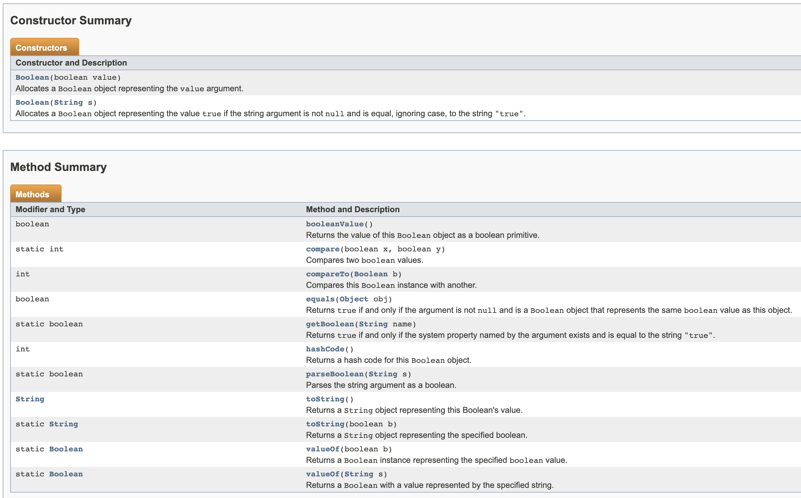
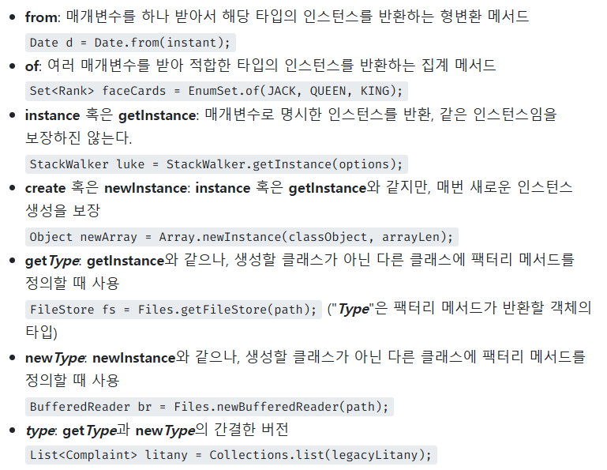

# 생성자 대신 정적 팩터리 메서드를 고려하라
클래스의 인스턴스를 생성하는 방법은 전통적인 수단으로 (1) public 생성자, (2) 정적 팩터리 메서드가 있다.

> 1. public 생성자
```java
public class Person {
	public Person() {
	}
}
```

> 2. 정적 팩터리 메서드
```java
public class Person {
	private static Person PERSON = new Person();
    
	private Person() { // 외부 생성 금지
	}

	public static final Person getInstance() { // factory method
		return PERSON;
	}
}
```

## 정적 팩터리 메서드?
static으로 선언된 메서드로, new Object()와 같이 객체 생성을 하지 않고 사용할 수 있는 메서드
실제로 Boolean객체의 `valueOf()`가 정적 팩터리 메서드.

이 메서드는 기본 타입인 boolean값을 받아 박싱 클래스인 Boolean 객체 참조로 변환해준다.
```java
public static Boolean valueOf(boolean b) {
	return b ? Boolean.TRUE : Boolean.FALSE;
}
```

## 정적 팩터리 메서드가 생성자보다 좋은 장점 5가지
### 1. 이름을 가질 수 있다.
생성자의 경우, 하나의 이름으로 생성자 오버로딩을 통해 표현해야 하기 때문에, 단순히 매개변수만 보고 의미하는 바를 정확하게 알기 힘든 경우가 많다.

> 반면, 정적 팩터리 메서드는 이름만 잘 지으면 반환될 객체의 특성을 쉽게 묘사할 수 있다.

ex) `BigInteger.probablePrime` : 값이 소수인 `BigInteger`를 반환한다.

동일한 시그니처를 가진 생성자도 여러 개 만들 수 없다.
```java
public class Foo {
	public Foo(String name) { ... }
	public Foo(String address) { ... } // 컴파일 에러
}
```
이런 경우, 정적 팩터리 메서드를 사용하는 것이 바람직하다.
```java
public class Foo {
    public Foo() { ... }
    public static withName(String name) {
        Foo foo = new Foo();
        foo.name = name;
        return foo;
    }
    public static withAddress(String address) {
        Foo foo = new Foo();
        foo.address = address;
        return foo;
    }
}
```

### 2. 호출될 때마다 인스턴스를 새로 생성하지 않아도 된다.
> 불변 클래스를 만들 수 있다.

정적 팩터리 메서드 호출을 위해 새로운 인스턴스를 생성하지 않기 때문에, 불변 클래스는 인스턴스를 캐싱하여 재활용하는 식으로 불필요한 객체 생성을 피할 수 있다.
- 불필요한 객체 생성을 막아 성능을 끌어올려 준다.

```java
public class Foo {
	private static final Foo GOOD_NIGHT = new Foo();
	public Foo() { ... }
	public static getInstance() { 
		return GOOD_NIGHT;
	} 

	public static void main(String[] args) {
		Foo foo = Foo.getInstance();
	}
}
```
`GOOD_NIGHT`이라는 상수를 만들어 `getInstance()`가 호출될 때마다 매번 새로운 Foo 객체가 아닌, 동일한 Foo 객체가 return 되도록 한다.

이와 비슷한 기법
> - 플라이웨이트 패턴
    >   - `공유`를 통하여 다양한 객체들을 효과적으로 지원
>   - 객체 내부에서 참조하는 객체를 직접 만들지 않고, 있다면 객체를 공유하고 없다면 만들어 준다. (Pool로 관리)
      >     - String Pool
>     - 데이터를 공유하여 메모리를 절약하는 패턴

#### 인스턴스 통제 클래스
이와 같이 반복되는 요청에 같은 객체를 반환하는 정적 팩터리 방식의 클래스는 인스턴스를 통제할 수 있다.
- 클래스를 싱글턴으로 만들 수 있다.
- 클래스를 인스턴스화 불가로 만들 수 있다.
- 불변 값 클래스에서 동치인 인스턴스가 단 하나뿐임을 보장할 수 있다.
    - a == b 일 때만 a.equals(b) 성립

### 3. 반환 타입의 하위 타입 객체를 반환할 수 있는 능력이 있다.
> 반환할 객체의 클래스를 자유롭게 선택할 수 있는 `유연성`을 부여해 준다.

정적 메서드로부터 인터페이스 자체를 반환하여, 구현 클래스를 공개하지 않고도 그 객체를 반환할 수 있다.
- 사용자는 객체를 인터페이스만으로 다룰 수 있다.

리턴타입의 하위 타입인 인스턴스를 만들어줘서 반환해도 되니, 리턴 타입은 인터페이스로 지정하고 구현 클래스를 API에 노출시키지 않고도 그 객체를 반환할 수 있다.

인터페이스를 정적 팩터리 메서드의 반환타입으로 사용하는 `인터페이스 기반 프레임워크`를 만드는 핵심 기술
- `java.util.Collections`
    - 명시한 인터페이스대로 동작하는 객체를 얻을 것임을 알기에 굳이 별도 문서를 찾아가면 실제 구현 클래스가 무엇인지 알아보지 않아도 된다.
    - 정적 팩터리 메서드를 사용하는 클라이언트는 얻은 객체를 인터페이스만으로 다루게 된다.

### 4. 입력 매개변수에 따라 매번 다른 클래스의 객체를 반환할 수 있다.
> 반환 타입의 하위 타입이기만 하면 어떤 클래스의 객체도 반환할 수 있다.

EnumSet 클래스는 생성자 없이 public static 메서드만 제공한다.

그 안에서 리턴하는 객체의 타입은 enum 타입의 개수에 따라 `RegularEnumSet`, `JumboEnumSet`으로 달라진다.

클라이언트는 이 두 클래스의 존재를 모르지만, EnumSet의 하위 클래스이기만 하면 된다는 것이다.

### 5. 정적 팩터리 메서드를 작성하는 시점에는 반환할 객체의 클래스가 존재하지 않아도 된다.
이런 유연함은 `서비스 제공자 프레임워크`를 만드는 근간이 된다.

서비스 제공자 프레임워크는 3가지 핵심 컴포넌트로 이뤄진다.
- 서비스 인터페이스 : 구현제의 동작을 정의
- 제공자 등록 API : 제공자가 구현체를 등록할 때 사용
- 서비스 접근 API : 클라이언트가 서비스의 인스턴스를 얻을 때 사용

종종 네 번째 컴포넌트가 쓰이기도 한다.
- 서비스 제공자 인터페이스 : 서비스 인터페이스의 인스턴스를 생성하는 팩토리 객체를 설명

대표적인 서비스 제공자 프레임워크로는 `JDBC`가 있다.
- MySQL, OracleDB, MariaDB 등 다양한 DB를 JDBC라는 프레임워크로 관리할 수 있다.
- getConnection()을 썼을 때 실제 return 되어 나오는 객체는 DB Driver마다 다르다.

## 정적 팩터리 메서드의 단점
### 1. 정적 팩터리 메서드만 제공하면 하위 클래스를 만들 수 없다.
상속을 하게 되면 `super()`를 호출하여 부모 클래스의 함수들을 호출하게 된다.

그러나 부모 클래스의 생성자가 `private`이라면 상속이 불가능하다.

보통 정적 팩터리 메서드만 제공하는 경우 생성자를 통한 인스턴스 생성을 `private`로 막는 경우가 많다.

ex) `Collections`는 생성자가 private로 구현되어 있기 때문에 상속할 수 없다.

그러나, 이 제약은 상속보다 컴포지션을 사용하도록 유도하고, 불변 타입으로 만들려면 이 제약을 지켜야한다는 점에서 오히려 장점으로 받아들이기도 한다.
- 컴포지션 : 기존 클래스를 확장하는 대신, 새로운 클래스를 만들고 private 필드로 기존 클래스의 인스턴스를 참조하는 방식

### 2. 정적 팩터리 메서드는 프로그래머가 찾기 어렵다.
어떤 라이브러리를 사용하기 위해 API 문서를 보면 정적 팩터리 메서드에 대해서 확인하기가 쉽지 않다.

아래 Boolean의 API 문서를 보면, 생성자에 대한 내용은 별도로 작성하여 구분이 잘된다.
그러나 정적 팩터리 메서드에 대해서는 일반 메서드와 같이 작성이 되어 있어 구분하기 쉽지 않다.


### 정적 팩터리 메서드 명명 방식


### 핵심 정리
정적 팩터리 메서드와 public 생성자는 각자의 쓰임새가 있지만, 정적 팩터리를 사용하는 게 유리한 경우가 더 많으므로 무작정 public 생성자를 제공하는 습관을 고치자