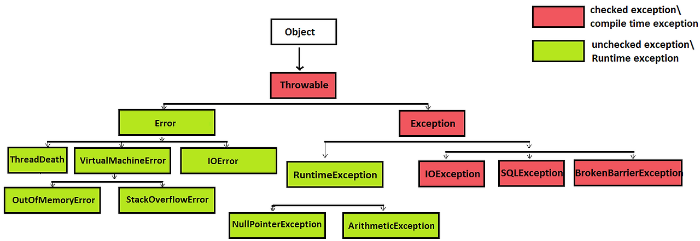

# 복구할 수 있는 상황에는 검사 예외를, 프로그래밍 오류에는 런타임 예외를 사용하라.

## 예외 계층 구조
> 자바는 문제 상황을 알리는 타입(throwable)으로 다음의 세 가지를 제공한다.


> - 검사 예외 : Exception 하위 클래스들
> - 런타임 예외 : RuntimeException 하위 클래스들
> - 에러 : Error 하위 클래스들

## 검사 예외(Checked Exception)
> 호출하는 쪽에서 복구하리라 여겨지는 상황이라면 검사 예외를 사용하자.

> - Exeption 클래스의 하위 클래스이면서 RuntimeException을 상속하지 않는 예외 유형이다.
> - 검사 예외가 발생할 수 있는 메소드를 작성할 때, 프로그래머는 반드시 예외를 처리하거나 던져야 한다. 그렇지 않으면 컴파일 오류가 발생한다.
> - 예상 가능하고 회복 가능한 상황에서 발생하는 오류를 나타낸다.
> - ex) IOException, SQLException
> - API 사용자에게 메소드의 실패 가능성을 명확하게 알려주며, 그 상황에 대응하도록 강제한다.
> - 단순히 예외를 잡아놓고 아무런 조치도 취하지 않는 것은 좋지 않은 관행으로, 예외 발생 원인을 해결하고 대응해야 한다.

### 복구에 필요한 정보를 알려주는 메소드도 제공하자.
> - 단순히 발생한 사실만 알려주는 것보다 더 많은 정보를 제공해야 한다.
>   - 이는 예외를 처리하는 데 필요한 중요한 정보를 제공할 수 있다.

```java
class InsufficientBalanceException extends Exception {
    private double shortfall;

    public InsufficientBalanceException(double shortfall) {
        super("Insufficient balance. You are short of " + shortfall);
        this.shortfall = shortfall;
    }

    public double getShortfall() {
        return shortfall;
    }
}

public class ShoppingMall {

    private double accountBalance = 100.0;  // 예시로 100달러 잔고

    public void purchase(double price) throws InsufficientBalanceException {
        if (accountBalance < price) {
            throw new InsufficientBalanceException(price - accountBalance);
        }
        accountBalance -= price;
    }

    public static void main(String[] args) {
        ShoppingMall mall = new ShoppingMall();
        
        try {
            mall.purchase(150.0);  // 150달러짜리 물건 구매 시도
        } catch (InsufficientBalanceException e) {
            System.out.println(e.getMessage());
            System.out.println("You need to deposit at least: " + e.getShortfall());
        }
    }
}
```
> 잔액이 부족할 시 얼마나 더 입금해야 하는지 알려준다.

## 비검사 예외(Unchecked Exception)
### 런타임 예외
> - 명시적으로 처리하지 않아도 컴파일 오류가 발생하지 않는다.
> - 프로그램의 정상적인 흐름에서는 발생하지 않아야 하므로, 발생할 경우 프로그램의 실행을 중단한다.
> - ex) NullPointerException, ArrayIndexOutOfBoundsException, ArithmeticException, OutOfMemoryError 등

#### 프로그래밍 오류를 나타낼 때는 런타임 예외를 사용하자
> - 프로그래밍 오류를 나타내기 위해 사용되는 예외이다.
> - RuntimeException 클래스를 상속받은 예외들을 의미한다.
> - 대부분 프로그램에서 지켜야 할 전제조건을 위반할 때 발생한다.
> - 즉, API 사용자가 해당 API의 문서나 명세에 적힌 규칙이나 제약사항을 지키지 않았을 때 발생하는 오류이다.
> - ex. 배열에서 범위를 벗어난 인덱스에 접근하려고 하면 ArrayIndexOutOfBoundsException이 발생한다.

> - 예외 상황이 복구 가능한 자원 고갈 문제인지, 아니면 복구 불가능한 심각한 프로그래밍 오류인지 구분하기 어려운 경우,
>   - 상황이 복구 가능하다고 판단되면 검사 예외를, 그렇지 않다면 런타임 예외를 사용한다.
>   - 애매하다면 런타임 예외를 사용하자

### 에러
> - 시스템 수준에서 일어나는 중대한 문제를 나타내며, 주로 프로그램 내에서 처리할 수 없는 상황을 나타낸다.
> - 따라서 어플리케이션 코드에서 이러한 에러를 처리하려는 시도를 하지 않아야 한다.
>   - ex) JVM에 할당된 메모리를 초과하는 상황이 발생한 경우 OutOfMemoryError 발생

### 개발자가 구현하는 비검사 throwable은 모두 RuntimeException의 하위 클래스여야 한다.
> - 개발자는 직접 예외 클래스를 만들 때 Error 클래스를 상속받아 하위 클래스를 만들어서는 안 된다.
> - 왜냐하면 Error는 시스템 수준의 오류를 나타내기 위한 것이므로 애플리케이션 수준에서 이를 상속받아 사용하는 것은 적절하지 않다.

### Error는 직접 throw 문을 사용하여 던져서는 안된다. (단, AssertionError는 예외)
> - AssertionError는 불변식이 깨졌을 때, 즉 프로그램의 논리적 오류를 나타낼 때 사용하는 에러.

## Throwable 상속은 하지 마라.
### 절대로 Throwable을 직접 상속받아 사용자 정의 throwable을 만들지 마라.
> - 사용자 정의 Throwable은 API 사용자에게 혼란을 줄 수 있으며, 코드의 명확성과 유지 보수성을 해칠 수 있다.
> - 대신 표준 예외 계층 구조를 사용하도록 하자.

## 예외 메서드
```java
public class CustomExceptionDemo {

    // 사용자 정의 예외
    public static class CustomException extends Exception {
        private int errorCode;

        public CustomException(int errorCode, String message) {
            super(message);
            this.errorCode = errorCode;
        }

        public int getErrorCode() {
            return errorCode;
        }
    }

    public static void main(String[] args) {
        try {
            // 예외 발생
            throw new CustomException(404, "Resource not found");
        } catch (CustomException e) {
            // 잡은 예외를 사용해 오류 정보 출력
            System.out.println("Error Code: " + e.getErrorCode());
            System.out.println("Error Message: " + e.getMessage());
        }

        // 오류 메시지 파싱 방식 (권장되지 않는 방식)
        String errorMessage = "Error 404: Resource not found";
        String[] parts = errorMessage.split(" ");
        try {
            int parsedErrorCode = Integer.parseInt(parts[1]); 
            System.out.println("Parsed Error Code: " + parsedErrorCode);
        } catch (Exception ex) {
            System.out.println("Failed to parse error message.");
        }
    }
}
```
> - 예외 역시 객체이다.
>   - CustomException은 일반 객체처럼 필드와 메소드를 포함하고 있다.
> - 예외의 메소드는 정보 전달에 유용하다.
>   - getErrorCode() 메소드는 예외와 함께 발생한 오류 코드를 가져올 수 있다.
> - 오류 메시지를 파싱하는 것은 좋지 않다.(item 12)
>   - JVM이나 릴리스에 따라 오류 메시지의 포맷이 달라질 수 있다.