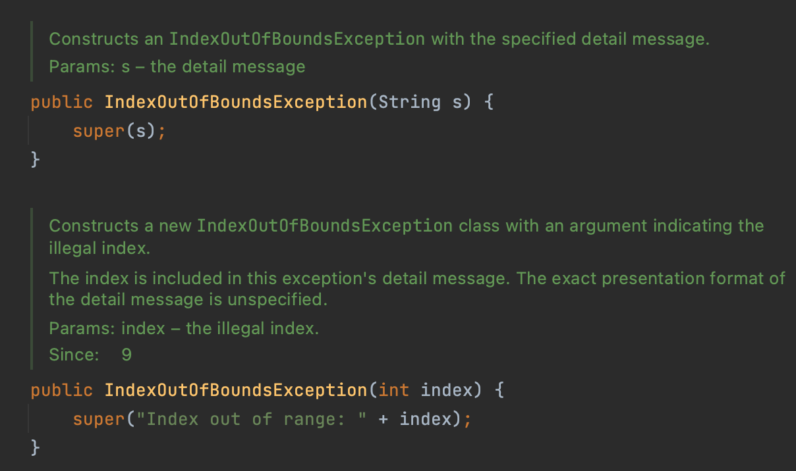

# 예외의 상세 메시지에 실패 관련 정보를 담으라
## 스택 추적
> - 예외를 잡지 못해 프로그램이 실패하면 자바 시스템은 그 예외의 스택 추적 정보를 자동으로 출력한다.
> - 스택 추적은 예외 객체의 toString 메서드를 호출해 얻는 문자열로, 보통은 예외의 클래스 이름 뒤에 상세 메시지가 붙는 형태다.
> - 이 정보가 실패 원인의 유일한 정보인 경우가 많고, 그 실패를 재현하기 어렵다면 더 자세한 정보를 얻기가 어렵거나 불가능하기 때문에, 예외의 toString 메서드에 실패 원인에 관한 정보를 가능한 많이 담아 반환하는 일은 아주 중요하다.
> - 달리 말하면, 사후 분석을 위해 실패 순간의 상황을 정확히 포착해 예외의 상세 메시지에 담아야 한다.

## 예외의 상세 메시지
> - 실패 순간을 포착하려면 발생한 예외에 관여된 모든 매개변수와 필드의 값을 실패 메시지에 담아야 한다.
> - `IndexOutOfBoundsException`의 상세 메시지는 범위의 최솟값과 최댓값, 그리고 그 범위를 벗어났다는 인덱스의 값을 담아야 한다.
> - 실패하는 상황마다 모두 원인이 다를 수 있으므로, 현상을 보면 무엇을 고쳐야 할지를 분석하는 데 큰 도움이 된다.


> IndexOutOfBoundsException은 String을 매개변수로 받고 있어 메시지를 만들어 보내야 한다. Java9에서 index를 받는 생성자가 추가됐지만 여전히 최댓값과 최솟값은 받지 않는다. 따라서 다음과 같이 필요한 정보를 모두 생성자에서 받고 상세 메시지까지 미리 생성해놓는 것도 좋은 방법 중 하나다.
```java
/**
 * IndexOutOfBoundsException을 생성한다.
 *
 * @param lowerBound 인덱스의 최솟값
 * @param upperBound 인덱스의 최댓값 + 1
 * @param index 인덱스의 실젯값
 */

public IndexOutOfBoundsException(int lowerBound, int upperBound, int index) {
   super(String.format("최솟값: %d, 최댓값: %d, 인덱스: %d", lowerBound, upperBound, index));

   // 실패 정보를 저장
   this.lowerBound = lowerBound;
   this.upperBound = upperBound;
   this.index = index;
}
```

> - 실패를 적절히 포착하려면 필요한 정보를 예외 생성자에서 모두 받아서 상세 메시지까지 미리 생성해 놓는 방법도 괜찮다.
> - 예를 들어, `IndexOutOfBoundsException`은 최솟값과 최댓값, 정수 인덱스를 받는 생성자가 있다면, 프로그래머가 던지는 예외는 자연스럽게 실패를 더 잘 포착할 것이다.
> - 또한 고품질의 상세 메시지를 만들어내는 코드를 예외 클래스 안으로 모아주는 효과도 있어, 클래스 사용자가 메시지를 만드는 작업을 중복하지 않아도 된다.

## 결론
> - 프로그램이 실패하면 자바 시스템은 그 예외의 스택 추적 정보를 자동으로 출력한다.
> - 이 실패 순간을 포착하려면 발생한 예외에 관여된 모든 매개변수와 필드의 값을 실패 메시지에 담아야 한다.
> - 장황할 필요는 없으나, 가독성보다는 담긴 내용이 중요하니 상세해야 한다.
> - 또한 실패를 적절히 포착하기 위해 필요한 정보를 예외 생성자에서 모두 받아서 상세 메시지까지 미리 생성해놓는 방법도 괜찮다.
> - 마지막으로 예외는 실패와 관련한 정보를 얻을 수 있는 접근자 메소드를 적절히 제공하는 것이 좋다.