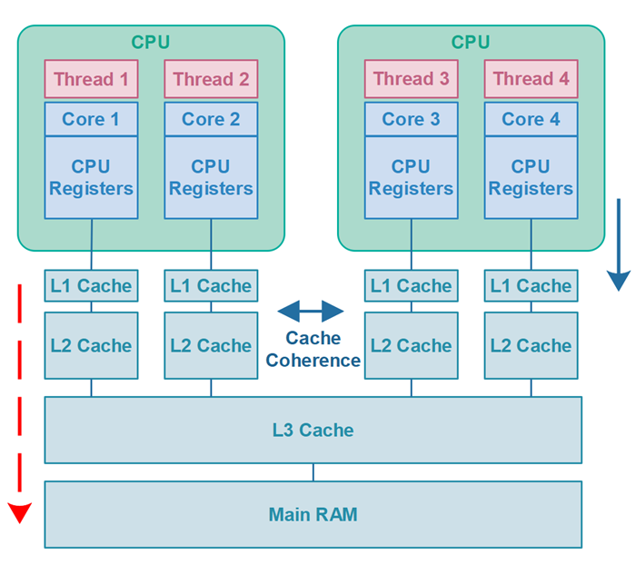
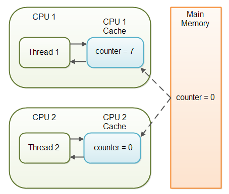

# 공유 중인 가변 데이터는 동기화해 사용하라

## 동기화란?
> - 다른 스레드가 변경중이어서 일관되지 않은 상태를 락을 검으로써 다른 스레드가 보지 못하게 막는다. 즉 일관성이 깨진 상태를 볼 수 없게 한다.
> - 락의 보호하에 수행된 모든 이전 수정의 최종 결과를 볼 수 있게 해준다.

> 우리는 자바의 `synchronized` 키워드를 통해, 해당 메서드나 블록을 한번에 한 스레드씩 수행하도록 보장하여 동기화를 할 수 있다.

## 왜 동기화가 필요할까?
> 애초에 `long`, `double` 외의 변수를 읽고 쓰는 동작은 원자적이어서, 동기화없이 여러 스레드가 한 변수를 수정해도 정상적으로 본인이 저장했던 값을 불러올 수 있다.

> 하지만 `수정이 완전히 반영된` 값은 보장해주지만, `해당 반영된 값이 다른 스레드에게 보이는가`는 보장해주지 않는다. 따라서, 스레드 사이 안정적인 통신에 반드시 동기화가 필요하게 된다.

### 기본형 타입이 원자적인 이유
> JVM은 데이터를 4바이트(32비트) 단위로 처리한다.
> - `int`보다 작은(이하) 타입 : 하나의 명령어로 처리되기 때문에, 한 스레드로만 처리된다(작업의 최소 단위).
> - `long`, `double` : `8`바이트를 넘어가기 때문에 여러 스레드가 개입될 여지가 생겨 원자적이라 할 수 없다.

### 예시
> - [StopThread.java](StopThread.java)
> - 스레드를 1초 멈춘 후에 반복문을 빠져나올 수 있도록 설정했으니, 1초 후에 프로그램이 종료가 되는게 정상이다.
> - 하지만, `stopRequested` 필드가 동기화가 되어 있지 않아, 수정된 값을 해당 스레드가 보는 것이 보장되지 않기 때문에 무한 루프를 돌게 된다.

> 만약 JVM의 최적화된 코드에서 메인 스레드가 수정한 `true` 값이 반영되기 이전 그 짧은 시간사이에 `stopRequested` 필드를 읽어와 버렸다면, if문이 이미 `false`가 되었기 때문에 응답 불가 상태가 되기 때문이다.

## synchronized 사용
> 동기화를 통해 정상적으로 메인 스레드가 공유 필드를 읽고 수정한 값이 완벽히 반영된 이후에 다른 스레드가 값을 읽도록 허용한다면 문제를 해결할 수 있다.
```java
private static synchronized void requestStop() { // 쓰기
     stopRequested = true;
}

private static synchronized boolean stopRequested() { // 읽기
    return stopRequested;
}
```

## volatile 사용
> `volatile` 키워드를 사용하면, `synchronized` 보다 동기화하는 속도가 더 빨라지며 따로 쓰기와 읽기 동기화 메서드를 만들지 않아도 된다.
```java
public class StopThread {
	private static volatile boolean stopRequested;
    ...
}
```

### volatile 개념
> - `volatile`이란, 공유 변수를 `캐시가 아닌 메인 메모리`에 저장하겠다라고 명시하는 키워드.
>   - 해당 키워드가 선언된 변수가 있는 코드는 최적화되지 않는다.
> - 
> - 기본적으로 CPU는 값에 대한 쓰기/읽기 연산을 수행할 때 `L1 Cache`를 사용함으로써 성능을 높인다.
> - 하지만 이게 오히려 멀티 스레딩 환경에서는 독이 되게 되는데, 다음과 같이 스레드1이 `counter` 공유 변수의 값을 `캐시에서만 증가시킴으로써 스레드2는 변경된 값을 볼 수 없는 문제`가 발생하기 때문이다.
```java
public class SharedObject {
    public int counter = 0;  // 공유 변수
}
```
> - 

### volatile 장점
> - 캐시가 아닌, `메모리`에 읽고 쓰는 연산이 이루어진다면 `다른 스레드라도 같은 메모리 주소를 참조`하기 때문에, 변수값 불일치 문제를 해결할 수 있으며 항상 최신의 값을 가져오는 것을 보장한다.
> - 따라서, `volatile`은 하나의 스레드만 쓰기/읽기 연산을 하고, 나머지 스레드들이 읽기 연산만을 하는 환경에서 사용하면 좋다.

### volatile 한계 및 주의사항
> - 하지만 멀티스레드 환경에서, `여러 쓰레드가 쓰기 연산을 하는 경우`에는 적합하지 않다.
> - 가시성(Visibility)은 해결해주지만, `상호 배제(Mutual Exclusion) 문제를 해결할 수 없기` 때문이다.
>   - Mutual Exclusion : 하나의 코드 블록은 하나의 스레드 또는 프로세스만 실행할 수 있음
>   - Visibility : 한 스레드가 공유 데이터를 변경하면 다른 스레드에서도 볼 수 있음

```java
private static volatile int nextNubmer = 0;

public static int generateNumber() {
	return nextNumber++;
}
```

> - 스레드1이 메인 메모리 변수 값을 읽어오고, `1` 증가시킨다.
> - 스레드2가 스레드1이 `변경시킨 값이 메인 메모리에 반영되기 전에` 변수 값을 읽어오고, `1` 증가시킨다.
> - 둘 다 변수 `0`일 때의 상태에서 `1`을 증가시켰으므로 `2`가 아닌 `1`이 최종적으로 반영되어 버린다.

> 이처럼 `volatile`은 공유 블록에 한번에 하나의 스레드만 접근하는 것을 막지 못한다.

> 따라서 이런 경우, `volatile`을 제거하고 `synchronized`를 붙여서 동시에 호출해도 서로 간섭하지 않는 상태에서 이전 호출이 변경한 값을 읽어올 수 있다.

## 락-프리 안전한 클래스
> `java.util.concurrent.atomic` 패키지의 `AtomicLong`을 사용하면 멀티스레딩 환경에서 락없이도 안전하게 사용할 수 있다.
```java
private static final AtomicLong nextNum = new AtomicLong();

public static long generateNumber() {
	return nextNum.getAndIncrement();
}
```

## 핵심 정리
> - 여러 스레드가 가변 데이터를 공유한다면, 데이터를 읽고 쓰는 동작 모두 동기화해야 한다.
> - 베타적 실행(여러 스레드의 동시 접근 제어)은 필요없고 스레드끼리의 통신만 필요하다면(반영된 값 읽어오기) `volatile` 만으로 동기화가 가능하나, 아니라면 둘 다 지원해주는 `synchronized`를 사용하자.