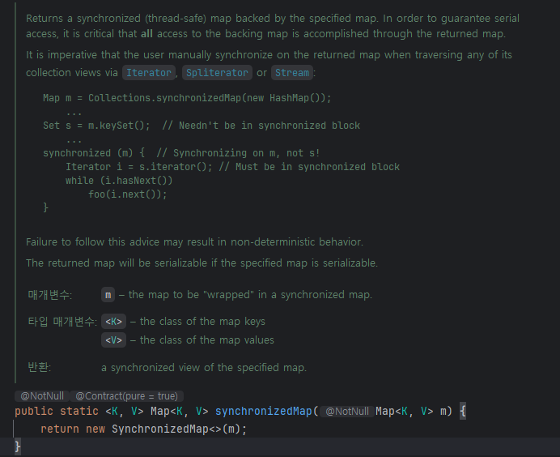

# 스레드 안정성 수준을 문서화하라

> - 여러 쓰레드가 하나의 메서드를 동시에 호출할 때 그 메서드가 어떻게 동작하느냐는 클라이언트와 클래스 간의 중요한 계약과도 같다.
> - 만약 API 문서에 아무런 언급이 없다면 사용자는 나름의 가정을 하고 사용해야 한다.
>   - 만약 이 가정이 틀리다면 프로그램은 심각한 오류로 이어질 수 있다.

## API 문서에 synchronized 한정자
> - synchronized 한정자가 달려있는 메서드는 스레드 안전하다고 생각할 수 있다.
>   - 하지만, 이는 몇 가지 면에서 틀렸다.
> - 메서드 선언에 synchronized 한정자를 선언할지는 구현 이슈일 뿐 API에 속하지 않는다.
>   - API에 표시되어 있지 않으니, 메서드를 호출하는 클라이언트는 해당 메서드가 synchronized 인지 알 수 없다.
>   - 따라서 이것만으로는 해당 메서드가 스레드 안전하다고 믿기 어렵다.
> - 멀티쓰레드 환경에서도 API를 안전하게 사용하려면 클래스가 지원하는 쓰레드 안전성 수준을 정확히 명시해야 한다.

## 쓰레드 안전성 수준
### 1. 불변(immutable)
> - 불변 클래스의 인스턴스는 상수와도 같아서 외부 동기화가 전혀 필요없다.
> - 쓰레드 세이프하다는 것이 아니다.
>   - 한 객체를 여러 쓰레드가 동시에 읽는 것이 안전하다.
>   - 애초에 불변 객체는 `쓰기`가 전혀 일어나지 않기 때문에, `동시에 읽기만 해도 안전`하다는 이야기 이지, `읽기, 쓰기를 모두 안전하게 지원한다.`와는 다른 개념이다.
> - 쓰레드 안전성 애너테이션 - @Immutable
>   - String, Long, BigInteger

### 2. 무조건적 쓰레드 안전(unconditionally thread-safe)
> - 이 클래스의 인스턴스는 수정될 수 있으나, 내부에서 충실히 동기화하여 별도의 외부 동기화없이 동시에 사용해도 안전하다.
> - @ThreadSafe
> - AtomicLong, ConcurrentHashMap

### 3. 조건부 쓰레드 안전(conditionally thread-safe)
> - 무조건적 쓰레드 안전과 같으나, 일부 메서드는 동시에 사용하려면 외부 동기화가 필요하다.
> - @ThreadSafe
> - Collections.synchronized 래퍼 메서드가 반환한 컬렉션

### 4. 쓰레드 안전하지 않음(not thread-safe)
> - 이 클래스의 인스턴스는 수정될 수 있다.
> - 동시에 사용하려면 각각의 메서드 호출을 클라이언트가 선택한 외부 동기화 메커니즘으로 감싸야 한다.
> - @NotThreadSafe
> - ArrayList, HashMap

### 5. 쓰레드 적대적(thread-hostile)
> - 이 클래스는 모든 메서드 호출을 외부 동기화로 감싸더라도 안전하지 않다.
> - 일반적으로 정적 데이터를 아무 동기화없이 수정한다.
> - 일반적으로 문제를 고쳐 재배포하거나, deprecated API로 지정한다.

## 조건부 쓰레드 안전 클래스 문서화 시 주의사항
> 가장 핵심은 어떤 순서로 호출할 때 외부 동기화가 필요한지, 그 순서로 호출하려면 어떤 락을 얻어야 하는지 문서화해야 한다.

### Collections.synchronizedMap
[SynchronizedMap.java](SynchronizedMap.java)

> `synchronizedMap이 반환한 맵의 컬렉션 뷰를 순회하려면 반드시 그 맵을 락으로 사용해 수동으로 동기화하라.`

> - 클래스의 쓰레드 안전성은 보통 클래스의 문서화 주석에 기재하지만, 독특한 특성의 메서드라면 해당 메서드의 주석에 기재하도록 하자.
> - 반환 타입만으로는 명확히 알 수 없는 정적 팩터리라면 자신이 반환하는 객체의 쓰레드 안전성을 반드시 문서화하자.

## 외부에 Lock 제공
> - 외부에서 사용하는 `락(Lock)`을 제공하면 클라이언트에서 일련의 메서드 호출을 원자적으로 수행할 수 있는 유연함을 얻을 수 있다.
> - 하지만 이를 사용함으로써 내부에서 처리하는 고성능 동시성 제어 메커니즘과 혼용할 수 없게 된다.
>   - ConcurrentHashMap 같은 고성능 동시성 컬렉션을 함께 사용하지 못한다는 뜻
> - 또한, 클라이언트가 서비스 거부 공격(denial-of-service attack)을 수행할 수도 있다.
>   - 클라이언트가 공개된 락을 오래 쥐고 놓지 않는다는 것
>   - 이 공격을 막으려면 `비공개 락 객체`를 사용해야 한다.
>     - synchronized 메서드는 공개 락으로 볼 수 있다.

### lock 필드는 항상 final
```java
// 비공개 락 객체 관용구 - 서비스 거부 공격을 막아준다.
private final Object lock = new Object();

public void someMethod() {
  synchronized(lock) {
      ....
  }
}
```
> - final로 선언하면 우연히라도 락 객체가 교체되는 일을 예방할 수 있다.
> - 비공개 락 객체는 클래스 바깥에서 볼 수 없으니 클라이언트가 동기화에 관여할 수 없다.
>   - 락 객체를 동기화 대신 객체 안으로 캡슐화한 것

### 비공개 락 객체 관용구
> - 비공개 락 객체 관용구는 `무조건적 쓰레드 안전 클래스에서만 사용 가능`
> - `조건부 쓰레드 안전 클래스에서는 사용 불가능` (특정 호출 순서에 필요한 락이 무엇인지 알려줘야 하므로)
> - 비공개 락 객체 관용구는 상속용으로 설계한 클래스에 특히 잘 맞음
>   - 하위 or 상위 클래스가 같은 락을 다른 목적으로 사용하게 되어 서로의 동기화 메커니즘을 깨트릴 수 있다.