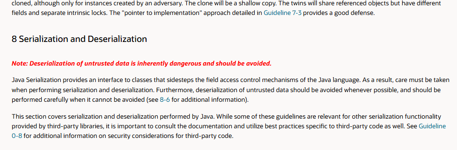

Java 직렬화의 대안을 찾으라
## Java 직렬화의 보안 문제
- 1997년 Java에 직렬화가 처음 도입 된 뒤, Java에서는 비교적 쉽게 분산 객체를 만들수 있게 됐으나 그에따른 성능, 보안, 유지보수성 등의 문제가 따랐음
- 특히 보안의 경우, 2000년대 초반에 논의된 취약점들이 10년 이상 심각하게 악용되었으며 2016년 11월 샌프란시스코 시영 교통국(SFMTA)이 랜섬 웨어 공격을 받은 사례가 있음
	- `웹로직 역직렬화 익스플로잇`이라는 취약점을 사용해 `프리마베라`와 같은 오라클 서버 제품을 목표로 공격
	- 이 취약점은 악의적으로 조작된 객체를 사용하여, 영향을 받는 라이브러리에서 이를 `역직렬화`하여 `압축을 푸는 방식을 악용`한 것
		- MedStar 공격에 사용된 것과 동일한 종류의 취약점
			- MedStar를 공격한 공격자는 [JexBoss](https://github.com/joaomatosf/jexboss)와 같은 오픈 소스 취약점 스캔 도구를 사용해 JBoss 플랫폼을 실행 시키는 서버를 찾아 공격
		- [San Francisco Rail System Hacker Hacked – Krebs on Security](https://krebsonsecurity.com/2016/11/san-francisco-rail-system-hacker-hacked/)
		- [Muni system hacker hit others by scanning for year-old Java vulnerability - Ars Technica](https://arstechnica.com/information-technology/2016/11/san-francisco-transit-ransomware-attacker-likely-used-year-old-java-exploit/)
## 직렬화는 공격 범위가 너무 넓고, 지속적으로 더 넓어져 방어하기가 어려움
- `객체 그래프`는 `ObjectInputStream`의 `readObject` 메서드를 호출해 역직렬화 되는데, 이 메서드는 기본적으로 (Serializable을 구현한) *클래스패스 안의* `**거의 모든 타입**의 객체를 인스턴스화` 할 수 있는 **마법같은 생성자**임
- `바이트 스트림`을 `역직렬화`하는 과정에서 `readObject`는 타입들 `내부의 모든 코드를 실행할 수 있어`, 타입들의 `코드 전체`가 `공격에 노출`됨
	- 이러한 `공격 범위`에는 `Java 플랫폼 라이브러리`, `서드파티 라이브러리`(ex. `Apache Commons Collections`), `애플리케이션 자체의 클래스`가 포함됨
- 만약 *관련된 모범 사례를 모두 준수하고, 공격에 취약하지 않은* `직렬화 가능 클래스`를 작성한다 해도, 애플리케이션은 여전히 **취약할 수 있음**
-  "**`룩-어헤드 객체 입력 스트림`으로 Java 역직렬화 취약점 대응하기(Combating Java Deserialization Vulnerabilities with Look-Ahead Object Input Streams (LAOIS))**" 라는 제목의 [영국의 보안 컨설팅 기업 NCC Group의 백서](https://www.nccgroup.com/media/z50dymds/_ncc_group_combating_java_deserialization_vulnerabilities_with_look-ahead_object_input_streams1.pdf)에서, CERT 조정센터 기술관리자인 로버트 시커드는 다음과 같이 말함
> 자바의 `역직렬화`는 지금도 **애플리케이션에 직접**, 또는 `자바 하부 시스템`,  이를테면 `RMI(Remote Method Invocation)`, `JMX(Java Management Extension)`, `JMS(Java Messaging System)`와 같은 시스템을 통해 **간접적으로 쓰이고 있음**
> `신뢰할 수 없는 스트림`을 역직렬화 할 경우, `원격 코드 실행(RCE, Remote Code Execution)`, `서비스 거부(DoS, Denial of Service)` 등의 공격으로 이어질 수 있음
> - `JMX`: Java 1.5에 소개된 프레임워크로, `로컬` 또는 `원격`으로 Java 애플리케이션을 관리하기 위해 쉽게 구성 및 확장 가능한 인프라를 제공함. JMX를 통해 리소스를 관리하기 위해 `MBeans`라는 객체를 사용하는 것이 특징.
> 	- [Basic Introduction to JMX | Baeldung](https://www.baeldung.com/java-management-extensions)
> - `JMS`: `Java EE`기반의 애플리케이션 컴포넌트가 메시지를 작성/전송/수신 할 수 있도록 하는 API로, `메시징 큐`를 이용해 비동기 메시징 지원
> 	- [1장 개념적 기초 - Sun Java System Message Queue 3 2005Q1 기술 개요 ](https://docs.oracle.com/cd/E19435-01/819-2222/concepts.html)
- 공격자와 보안 전문가들은 `가젯(gadget)`이라 부르는, *`역직렬화 과정에서 호출`되어 잠재적으로 `위험한 동작을 수행`하는 메서드*를 Java 라이브러리 및 서드파티 라이브러리의 `직렬화 가능 타입`들을 연구하여 찾음
- 이러한 `가젯`들은 여러 개를 함께 사용해 `가젯 체인`을 구성할 수 있는데, 가끔 공격자가 특정 `바이트 스트림`을 제공할 경우 `기반 하드웨어`에서 임의의 `네이티브 코드`를 실행할 수 있는 **강력한 가젯 체인**도 발견됨
	- 이것이 위에서 다룬 **SFMTA**의 Muni 시스템 공격에서 일어난 일
### 역직렬화 폭탄(deserialization bomb)
```java
// 이 스트림의 역직렬화는 영원히 계속 됨
static byte[] bomb() {
	Set<Object> root = new HashSet<>();
	Set<Object> s1 = root;
	Set<Object> s2 = new HashSet<>();
	for (int i = 0; i < 100; i++) {
		Set<Object> t1 = new HashSet<>();
		Set<Object> t2 = new HashSet<>();
		t1.add("foo"); // t1을 t2와 다르게 만든다
		s1.add(t1); s1.add(t2);
		s2.add(t1); s2.add(t2);
		s1 = t1;
		s2 = t2;
	} 
	return serialize(root); // 코드를 간결하게 설명하고자 해당 메서드의 코드는 생략
}
```
- *역직렬화하는 데에 오랜 시간이 걸리는* 짧은 스트림의 역직렬화를 요청하는 것 만으로도 `서비스 거부 공격`을 쉽게 일으킬 수 있는데, 이러한 스트림을 `역직렬화 폭탄`이라고 함
- 위 코드는 `역직렬화 폭탄`의 예시 중 하나
	- 위 객체 그래프는 201개의 `HashSet` 인스턴스로 구성되며, 각 인스턴스는 3개 이하의 객체 참조를 가짐
	- 스트림의 크기는 5,744 바이트로 크지 않지만 역직렬화는 평생 걸릴 것임
		- 왜냐면 `HashSet` 인스턴스의 역직렬화를 위해, 그 원소들의 `해시코드`를 계산해야 하기 때문
	- 루트 `HashSet`에 담긴 두 원소는 각각 다른 `HashSet` 2개를 원소로 갖는 `HashSet`인데, 이러한 구조가 깊이 100단계 까지 만들어진 것
	- 따라서 이 `HashSet`을 역직렬화 하려면 `hashCode` 메서드를 $2^{100}$회 이상 호출해야 함
	- `역직렬화기(Deserializer)`는 문제가 발생했다는 어떠한 신호도 주지않으며, 몇 개의 객체만 생성되어도 `스택 깊이 제한`에 걸려버림
## 직렬화 위험을 회피하기 위해서는 아무것도 역직렬화 하지 말 것
- 애초에 `신뢰할 수 없는 바이트 스트림`을 역직렬화 하는 것 자체가 `스스로를 공격에 노출` 시키는 것이므로, **아무것도 역직렬화 하지 않으면 됨**
- *앞으로 작성하게 될 모든 시스템에서* `Java 직렬화`를 사용할 이유는 전혀 없음
- `객체`와 `바이트 시퀀스`를 변환해주면서도, 다양한 플랫폼 지원, 고성능, 풍부한 지원 도구 생태계 등 이점을 갖는 다른 `크로스-플랫폼 구조화된 데이터 표현(Cross-platform structed-data representation)`들이 많이 있음
- 이러한 표현 방식들의 공통점은 **`Java 직렬화`보다 훨씬 간단하다**는 것
	- 임의의 객체 그래프를 *자동으로 직렬화/역직렬화하지 않고*, `속성-값`쌍의 모음으로 구성된 단순하고 구조화된 `데이터 객체`를 사용
		- 이를 위해 몇 가지 기본 데이터 타입과 배열 타입을 지원
	- `추상화`를 통해 강력한 `분산 시스템`을 구축할 수 있으며 Java 직렬화의 문제들을 **회피할 수 있음**
### 크로스-플랫폼 구조화된 데이터 표현
```protobuf
// 프로토콜 버퍼 스키마 예시
syntax = "proto2";

package tutorial;

option java_multiple_files = true;
option java_package = "com.example.tutorial.protos";
option java_outer_classname = "AddressBookProtos";

message Person {
  optional string name = 1;
  optional int32 id = 2;
  optional string email = 3;

  enum PhoneType {
    PHONE_TYPE_UNSPECIFIED = 0;
    PHONE_TYPE_MOBILE = 1;
    PHONE_TYPE_HOME = 2;
    PHONE_TYPE_WORK = 3;
  }

  message PhoneNumber {
    optional string number = 1;
    optional PhoneType type = 2 [default = PHONE_TYPE_HOME];
  }

  repeated PhoneNumber phones = 4;
}

// 위의 스키마에 대응되는 pbtxt는 다음과 같음
//
// name: "Alice"
// id: 123
// email: "alice@example.com"
// phones {
//   number: "010-1234-5678"
//   type: PHONE_TYPE_MOBILE
// }
// phones {
//    number: "02-987-6543"
//    type: PHONE_TYPE_WORK
// }


message AddressBook {
  repeated Person people = 1;
}
```
- 잘 알려진 `크로스-플랫폼 구조화된 데이터 표현`으로는 `JSON`과 `프로토콜 버퍼(protobuf, Protocol Buffers)`가 있음
- `JSON`은 [더글라스 크록퍼트](https://ko.wikipedia.org/wiki/%EB%8D%94%EA%B8%80%EB%9D%BC%EC%8A%A4_%ED%81%AC%EB%A1%9D%ED%8F%AC%EB%93%9C)라는 개발자가 브라우저-서버 간 통신용으로 설계했으며, `Javascript`용으로 설계됨
- `프로토콜 버퍼`는 [구글](https://protobuf.dev/)이 *서버 간* `데이터 교환/저장`을 위해 설계했으며, `C++`용으로 설계됨
- 둘의 가장 큰 차이는 `표현 방식`임
	- `JSON`은 `텍스트 기반`이라 **사람이 읽을 수 있으며**, 데이터를 표현하기 위해 사용
	- `프로토콜 버퍼`는 `이진 표현`이라 효율이 더 높으며, `스키마(타입)`를 통해 **사용법을 문서화 및 강제**할 수 있음. 또한 사람이 읽을 수 있는 `대체 텍스트 표현(pbtxt)`을 제공
## 차선책 1 - 신뢰할 수 없는 데이터는 절대 역직렬화 하지 말 것
- 만약 레거시 시스템 때문에, 자바 직렬화를 완전히 배제할 수 없는 경우 이처럼 행동해야 함
	- 특히, `신뢰할 수 없는 발신원`으로 부터의 `RMI`는 절대 수용해서는 안 됨


- [자바의 공식 보안 코딩 지침](https://www.oracle.com/java/technologies/javase/seccodeguide.html#8)에서는 위처럼 "**신뢰할 수 없는 데이터의 역직렬화는 본질적으로 위험하므로 절대로 피해야 한다**"라고 강조
## 차선책 2 - 객체 역직렬화 필터링을 사용하자
```java
// GPT로 만든 간단한 예시 코드
package chapter12.item85;

import java.io.*;

public class ObjectInputFilterExample {

    public static class Person implements Serializable {
        private static final long serialVersionUID = 1L;

        private String name;
        private int age;

        public Person(String name, int age) {
            this.name = name;
            this.age = age;
        }

        public String toString() {
            return "Person{name='" + name + "', age=" + age + "}";
        }
    }
    public static class WrongPerson implements Serializable{
        private String name;
        public WrongPerson(String name) {
            this.name = name;
        }
        public String toString() {
            return "WrongPerson{name='" + name + "}";
        }
    }
    public static void main(String[] args) {
        // 직렬화
        Person person = new Person("Alice", 30);
        WrongPerson wrongPerson = new WrongPerson("ABCDEF");
        byte[] data = serialize(person);
        byte[] wrongData = serialize(wrongPerson);

        System.out.println(Person.class.getName());
        // 역직렬화
        deserialize(data);
        // 예외값 역직렬화
        deserialize(wrongData);
    }

    // 직렬화 메서드
    private static byte[] serialize(Object obj) {
        try (ByteArrayOutputStream baos = new ByteArrayOutputStream();
             ObjectOutputStream oos = new ObjectOutputStream(baos)) {

            oos.writeObject(obj);
            return baos.toByteArray();

        } catch (IOException e) {
            throw new RuntimeException("Serialization error", e);
        }
    }

    // 역직렬화 메서드
    private static void deserialize(byte[] data) {
        try (ByteArrayInputStream bais = new ByteArrayInputStream(data);
             ObjectInputStream ois = new ObjectInputStream(bais)) {

            // ObjectInputFilter 설정: Person 클래스만 허용
            // createFilter 메서드는 ;로 구분되는 문자열 패턴을 매개변수로 받음
            // maxdepth=value, maxbytes=value과 같은 속성을 설정할 수도 있고
            // 아래 예시 처럼 클래스 이름을 설정해, 이와 일치하는 클래스는
            // 허용하거나 거부할 수 있음
            // 1. 패턴이 !로 시작할 경우 나머지 패턴이 일치할 때 클래스가 거부되며,
            // !로 시작하지 않을 경우 패턴이 일치하는 클래스들이 허용됨
            // 2. 패턴이 *로 끝나면 해당 패턴을 접두사로 쓰는 모든 클래스와 일치함
            // 즉, 아래 패턴은 Class.getName()에서 반환되는 클래스 또는 패키지 이름이 "Person"과 일치하는 경우 허용하고,
            // 그 외의 패턴은 전부 거부하는 형태
            // 정확히는, FQCN(Fully Qualified Class Name)으로 "패키지명을 포함한 클래스 이름"을 입력해야 함
            // 또한, !*를 통해 필터링하지만, String과 같이 일부 자바 시스템 클래스는 예외적으로 통과함
            ObjectInputFilter filter = ObjectInputFilter.Config.createFilter("chapter12.item85.ObjectInputFilterExample$Person;!*");
            ois.setObjectInputFilter(filter);

            Object obj = ois.readObject();
            System.out.println("Deserialized object: " + obj);

        } catch (InvalidClassException e) {
            System.err.println("Invalid class during deserialization: " + e.getMessage());
        } catch (IOException | ClassNotFoundException e) {
            System.err.println("Deserialization error: " + e.getMessage());
        }
    }
}
```
- *직렬화를 피할 수 없고, 역직렬화한 데이터가 안전한지 확신할 수 없을 경우* `객체 역직렬화 필터링(java.io.ObjectInputFilter)`를 사용할 것
	- 이는 [Java 9에서 추가되었으며](https://docs.oracle.com/javase/9/docs/api/java/io/ObjectInputFilter.html), 이전 버전에서도 사용할 수 있도록 이식됨
- `객체 역직렬화 필터링`을 사용하면, `데이터 스트림`이 *역직렬화되기 전에* 적용되는 `필터`를 **지정할 수 있음**
	- 이는 *클래스 단위로 작동하며*, 특정 `클래스`를 **`허용`하거나 `거부`할 수 있음**
	- 필터링에는 `블랙리스팅`, `화이트리스팅` 두 가지 방식이 있음
		- `블랙리스팅`: 기본적으로 `클래스들을 허용`하되, *`잠재적으로 위험한 클래스`들이 기록된* `블랙리스트`에 오른 클래스들을 **거부**
		- `화이트리스팅`: 기본적으로 `클래스들을 거부`하되, *`안전하다고 추정되는 클래스`들이 기록된* `화이트리스트`에 오른 클래스들을 **허용**
	- 일반적으로 `화이트리스팅` 방식을 추천하는데, `블랙리스팅` 방식은 `알려진 위협`으로부터만 사용자를 보호하기 때문
	- 또는, [스왓(SWAT, Serial Whitelist Application Trainer, 직렬 화이트리스트 애플리케이션 트레이너)](https://github.com/cschneider4711/SWAT)라는 도구를 사용해 애플리케이션을 위한 `화이트리스트`를 자동으로 생성할 수도 있음
- `필터링` 기능은 `과도한 메모리 사용`, `지나치게 깊은 객체 그래프`로 부터 사용자를 보호하지만, 앞서 설명한 `역직렬화 폭탄`과 같은 공격은 **보호하지 못함**
# 핵심 정리
- `직렬화`는 **위험**하니 **피해야 함**
	- *시스템을 밑바닥부터 설계한다면*, `JSON` 또는 `프로토콜 버퍼`와 같은 대안을 사용할 것
- `신뢰할 수 없는 데이터`는 **역직렬화 하지 말 것**
	- 꼭 해야 한다면 `객체 역직렬화 필터링`을 사용하되, 이것이 **모든 공격을 막을 수는 없음**을 기억할 것
- `클래스`가 **직렬화를 지원하도록 만들지 말고**, 그렇게 만들어야 한다면 **신경써서 작성할 것**
