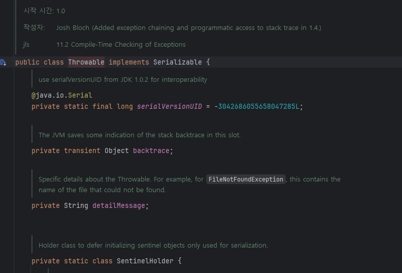

# Serializable을 구현할지는 신중히 결정하라
## 직렬화 가능한 클래스
> - `Serializable` 을 구현하도록 클래스에 선언하면 직렬화 가능한 클래스가 된다.
> - 매우 간단한 선언 방법과 다르게 구현한 대가는 매우 비싸다.
>   - 구현한 순간부터 많은 위험성을 갖게 되고 확장성을 잃게 된다.

## 릴리즈 후에 수정이 어렵다.
> - `Serializable`을 구현하면 직렬화 형태도 하나의 공개 API가 되는 것이다.
>   - 직렬화 형태는 적용 당시 클래스의 내부 구현 방식에 종속적이게 되는 것이다.
>   - 또한 클래스의 private과 package-private 인스턴스 필드마저 `API로 공개`되기 때문에 캡슐화도 깨진다.

> - 클래스의 내부 구현을 수정한다면 원래의 직렬화 형태와 달라지게 된다.
>   - 구버전의 인스턴스를 직렬화한 후에 신버전 클래스로 역직렬화를 시도하면 오류가 발생할 것이다.
>   - 이에 대한 테스트 요소가 많아지기도 한다.

> - 한편 수정을 어렵게 만드는 요소로 SerialVersionUID를 뽑을 수 있다.
> - 모든 직렬화된 클래스는 고유 식별 번호를 부여받는다.
> - 클래스 내부에 직접 명시하지 않는 경우 시스템이 런타임에 자동으로 생성한다.
> - SUID를 생성할 때는 클래스의 이름, 구현하도록 선언한 인터페이스들 등등이 고려된다.
>   - 따라서 나중에 수정하게 된다면 SUID 값도 변한다.
> - 즉, 자동 생성되는 값에 의존하면 호환성이 쉽게 깨져버린다.

## 버그와 보안에 취약하다.
> - 자바에서는 객체를 생성자를 이용해 만든다.
>   - 하지만 직렬화는 이러한 언어의 기본 방식을 우회하여 객체를 생성한다.
>   - ObjectOutputStream / ObjectInputStream 을 통한 (역)직렬화 과정에서는 JVM이 생성자를 전혀 호출하지 않고, 메모리만 할당한 뒤 내부를 통해 바로 객체를 복원한다.
> - 역직렬화는 일반 생성자의 문제가 그대로 적용되는 ‘숨은 생성자’이다.
>   - 역직렬화를 사용하면 불변식이 깨질 수 있고 허가되지 않은 접근에 쉽게 노출될 수 있다.

## 구현 여부는 쉽게 결정할 것이 아니다.
> - Serializable을 꼭 구현해야 한다면 클래스를 설계할 때마다 따르는 이득과 비용을 잘 고려해야 한다.
> - 예를 들어 BigInteger와 Instant 같은 `값` 클래스와 컬렉션 클래스는 Serializable을 구현하였고 스레드 풀처럼 `동작` 하는 객체를 표현한 클래스는 대부분 구현하지 않았다.
> - 값 클래스·컬렉션은 내부 구조가 온전히 데이터이기 때문에 `꽉 찬 상태를 저장–불러오기`가 곧 의미 있는 동작이다.
>   - 반면 스레드 풀 같은 경우에는, 실행 중인 쓰레드 상태, 큐에 대기 중인 작업, 외부 리소스 연결 등 단순 바이트 스트림으로 저장했다 복원해봤자 `어디서부터 다시 실행해야 할지` 알 수 없고, 안전하지도 않다.

## Serializable을 구현하면 안되는 경우
> - 상속 목적으로 설계된 클래스와 대부분의 인터페이스는 Serializable을 구현하면 안된다.
>   - 클래스를 확장하거나 인터페이스를 구현하는 대상에게 앞서 살펴본 위험성을 그대로 전이하는 것이다.

> - 하지만 Serializable을 구현한 클래스만 지원하는 프레임워크를 사용해야 한다면 방법이 없을 것이다.
>   - 대표적으로 Throwable 클래스가 있는데 서버가 RMI를 통해 클라이언트로 예외를 보내기 위해 Serializable을 구현하였다.
>   - 예외 발생시, 서버 쪽에 던진 예외도 네트워크를 통해 클라이언트로 전파되어야 한다.


> - 만일 직렬화와 확장이 모두 가능한 클래스를 만든다면, 하위 클래스에서 finalize 메서드를 재정의하지 못하게 해야 한다.
>   - finalize()는 객체가 GC에 의해 수거되기 직전에 호출되는 메서드로, 리소스 정리 등을 담당한다.
>   - 직렬화 가능한 클래스가 확장되어 하위 클래스에서 finalize()를 재정의하면, 예상치 못한 타이밍에 하위 로직이 실행되어 일관성이 깨질 수 있다.
>   - 간단하게 자신이 재정의하고 final 키워드를 붙이면 된다.
> - 인스턴스 필드 중 기본값으로 초기화되면 위배되는 불변식이 있다면 아래와 같은 메서드를 추가해야 한다.
```java
private void readObjectNoData() throws InvalidObjectException {
    throw new InvalidObjectException("스트림 데이터가 필요합니다.");
}
```
> - `스트림에 해당 클래스의 데이터가 전혀 없을 때` JVM이 호출하는 콜백 메서드
>   - A → B 클래스를 역직렬화하는데, 바이트 스트림에 A의 데이터는 없고 B만 있을 때

### RMI (Remote Method Invocation)
> - 원격 함수 호출
> - 클라이언트에서 바로 서버로 접속이 불가능한 환경일때, 가상환경에 인터페이스를 두고 통신하는 방식이다.

## 내부 클래스는 직렬화를 구현하면 안된다.
> - 기본 직렬화 형태가 명확하지 않다.
> - 내부 클래스는 바깥 인스턴스의 참조와 유효 범위에 속한 지역변수를 저장하기 위한 필드가 필요하다.
>   - 이 필드들은 컴파일러가 자동으로 추가하는데, 익명 클래스와 지역 클래스의 네이밍 규칙이 자바 명세에 없는 것처럼 이 필드들도 어떻게 추가되는지 알 수가 없다.
> - 단, 정적 멤버 클래스는 예외다.

