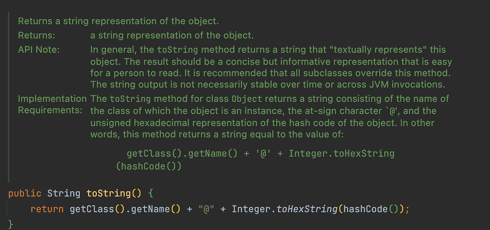

# toString을 항상 재정의하라

## toString 메서드
> - Java의 `Object`클래스에 정의된 메서드
> - 객체의 정보를 문자열로 반환할 때 사용
> - 모든 Java 객체는 `Object` 상속받기 때문에 `toString`메서드를 가지고 있다.

> - 하지만, `Object`의 기본 `toString`메서드가 우리가 작성한 클래스에 적합한 문자열을 반환하는 경우는 거의 없다.
> - 단순히 클래스_이름@16진수로 표시한 해시코드 를 반환할 뿐이다.
> - 

> - toString의 일반 규약에 따르면 `간결하면서 사람이 읽기 쉬운 형태의 유익한 정보`를 반환해야 한다고 한다.
>   - 모든 서브클래스에서 toString 메서드를 재정의하는 것을 권장하고 있다.

## toString은 언제 활용될까?
아래의 경우에 toString은 자동으로 호출된다.
> - 객체를 println, printf, 문자열 연결 연산자(+), assert 구문에 넘길 때
> - 디버거가 객체를 출력할 때
> - 우리가 만든 객체를 참조하는 컴포넌트가 오류 메시지를 로깅할 때

```java
❌ Assertions failure: expected {abc, 123}, but was {abe, 123}
// 단언 실패: 예상 값 {abc, 123}, 실젯값 {abc, 123}
```

결국, toString이 호출되어졌을 때, 기본적으로 반환되는 문자로는 유익한 정보를 알기 힘드므로 재정의를 하여 우리가 해당 인스턴스가 어떤 인스턴스인지 알 수 있는 유익한 정보를 반환해주도록 하는 것이 목적이다.

```
public class Wizard {
    private String lastName;
    private String firstName;
    
    @Override
    public String toString() {
        return "Wizard{" +
                "성 ='" + lastName + '\'' +
                '}';
    } // toString 에 lastName 정보만 담겨져 있다.
}
```

```java
class WizardTest {
    @Test
    void toString_테스트() {
        Wizard w1 = new Wizard("포터", "제임스");
        Wizard w2 = new Wizard("포터", "해리");

        Assertions.assertEquals(w1, w2); // 둘의 equals 비교
    }
}
```

```java
❌ toString_테스트() // 서로 다르다!
Expected :Wizard{성 ='포터'}
Actual   :Wizard{성 ='포터'} // 그러나 보기에는 같아보임.
```

## toString을 구현할 때면 반환값의 포맷을 문서화할지 정해야 한다.
- 전화번호나 행렬같은 값 클래스는 문서화하길 권장한다.
- 포맷을 명시하면 ('010-1234-5678'과 같이) 사람이 읽기 쉽다.
- 포맷을 명시하기로 했다면, 명시한 포맷에 맞는 문자열과 객체를 서로 전환할 수 있는 정적 팩터리나 생성자를 함께 제공하면 좋다.
```java
// BigInteger, BigDecimal과 대부분의 기본 타입 클래스가 여기 해당한다.
String s = "10000000000000";
BigInteger b1 = new BigInteger(s); //자동 형변환
```

### 포맷을 명시했을 때 단점
> - 포맷을 한 번 명시 후에, 프로그래머들이 해당 포맷에 맞춰 의존적인 코드를 작성한다면 포맷을 바꿨을 때 코드들은 엉망이 되어버린다.
> - 포맷을 명시하지 않으면, 이 부분에서는 유연성을 얻게 된다.

## 포맷을 명시하든 아니든 의도를 명확히 밝히자.
- 명시한 경우
```java
/**
* 이 전화번호의 문자열 표현을 반환한다.
* 이 문자열은 "XXX-YYY-ZZZZ" 형태의 12글자로 구성된다.
* XXX는 지역코드, YYY는 프리픽스, ZZZZ는 가입자 번호다.
* 각각의 대문자는 10진수 숫자 하나를 나타낸다.
* 
* 전화번호의 각 부분의 값이 너무 작아서 자릿수를 채울 수 없다면,
* 앞에서부터 0으로 채워나간다. 예컨데 가입자 번호가 123이라면
* 전화번호의 마지막 네 문자는 "0123"이 된다.
*/
@Override 
public String toString() {
    return String.format("%03d-%03d-%04d", areaCode, prefix, lineNum);
}
```

- 명시하지 않은 경우
```java
/**
* 이 약물에 관한 대략적인 설명을 반환한다.
* 다음은 이 설명의 일반적인 형태이나,
* 상세 형식은 정해지지 않았으며 향후 변경될 수 있다.
* 
* "[약물 #9: 유형-사랑, 냄새=테러빈유, 겉모습=먹물]"
*/
@Override
public String toString() { ... }
```
> - 이러한 설명이 있어야 프로그래머들이 이 포맷에 맞춰 코드를 작성할 것이다.

## toString이 반환된 값에 포함된 정보를 얻어올 수 있는 API를 제공하자.
> - toString으로 공개된 데이터라면, toString을 구성하는 각각의 데이터를 따로따로 받을 수 있는 메서드들을 제공하자.
>   - `getter`를 제공하자
> - 각 필드에 대한 getter가 없다면 toString의 반환값을 파싱하는 수밖에 없다.
>   - 상당히 비효율적이다.

## 자동 생성
> - 역시 구글의 AutoValue 프레임워크 또는 IDE에서 `equals()`, `hashCode()`들과 마찬가지로 `toString()`도 자동으로 생성하는 기능이 있다.
> - 하지만, `클래스의 특성`까지는 파악하지 못한다.
> - 잘 판단해서, toString()을 재정의하도록 하자.