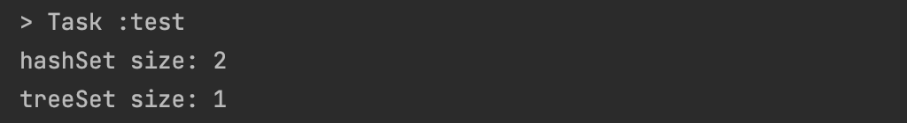

# Comparable을 구현할지 고려하라
## Comparable 인터페이스
`Comparable` 인터페이스의 `compareTo`메서드는 객체를 비교할 수 있도록 만드는 메서드이다.

단순 동치성 비교에 더해 순서까지 비교할 수 있으며, 제네릭하다는 두 가지를 제외하면 `equals`와 동일하게 동작한다.
```java
public interface Comparable<T> {
	int compareTo(T t);
}
```

`compareTo`는 주어진 객체의 순서를 비교하는 메서드이다.
1. 해당 객체가 주어진 객체보다 `작은` 경우 : 음수 반환(-1)
2. 해당 객체가 주어진 객체보다 같은 경우 : 0 반환
3. 해당 객체가 주어진 객체보다 큰 경우 : 양수 반환(1)

사실상, 자바 플랫폼 라이브러리의 모든 값 클래스와 열거 타입들은 모두 `Comparable` 인터페이스를 구현하고 있다.

## compareTo와 정렬
```java
 private static void mergeSort(Object[] src, Object[] dest, int low, int high, int off) {
        int length = high - low;

        // Insertion sort on smallest arrays
        if (length < INSERTIONSORT_THRESHOLD) {
            for (int i=low; i<high; i++)
                for (int j=i; j>low &&
                         ((Comparable) dest[j-1]).compareTo(dest[j])>0; j--)
                    swap(dest, j, j-1);
            return;
        }

        // Recursively sort halves of dest into src
        int destLow  = low;
        int destHigh = high;
        low  += off;
        high += off;
        int mid = (low + high) >>> 1;
        mergeSort(dest, src, low, mid, -off);
        mergeSort(dest, src, mid, high, -off);
}
```

위 코드를 보면, 인접한 두 객체의 `compareTo` 결과가 0이상이라면 두 객체의 순서를 뒤집는다.</br>
기본값이 오름차순인 정렬이므로, 당연히 현재 객체가 주어진 객체보다 큰 경우 양수를 반환한다 했으니, 스왑이 일어난다.

## equals와 compareTo
정렬에서 동치성을 비교할 때 `equals` 가 아닌 `compareTo`를 사용하니, `equals` 규약을 똑같이 만족해야 한다는 것을 볼 수 있다.

예시로 `BigDecimal`은 `compareTo`와 `equals`가 일관되지 않는다. </br>
2.0과 2.00을 뒀을 때, equals는 다른 객체로 보지만, compareTo는 동일한 것으로 간주되기 때문이다.
```java
@Test
void test1() throws IOException {
    BigDecimal b1 = new BigDecimal("1.0");
    BigDecimal b2 = new BigDecimal("1.00");

    Set hashSet = new HashSet();
    hashSet.add(b1);
    hashSet.add(b2);    // 2개
    System.out.println("hashSet size: " + hashSet.size());

    Set treeSet = new TreeSet();
    treeSet.add(b1);
    treeSet.add(b2);
    System.out.println("treeSet size: " + treeSet.size());
}
```


## compareTo 메서드 작성 요령
1. 타입을 인수로 받는 제네릭 인터페이스이다.
   - `compareTo`메서드의 인수 타입은 컴파일 타임에 정해지므로, 입력 인수의 타입을 확인하거나 형변환할 필요가 없다.
2. `null`을 인수로 넣어 호출하면, `NullPointerException`을 던져야 한다.
3. 객체 참조 필드를 비교하는 경우
    - `compareTo`메서드를 재귀적으로 호출한다. `Comparable`을 구현하지 않은 필드나 표준이 아닌 순서로 비교해야 한다면 `Comparator`을 사용하자.
```java
public int compareTo(CaseInsensitiveString cis) {
    return String.CASE_INSENSITIVE_ORDER.compare(s, cis.s);
}
```
4. 정수 타입 기본 필드를 비교하는 경우
   - 박싱된 기본 타입 클래스들에 새로 추가된 정적 메서드 `compare`을 사용한다.
```java
public final class Integer extends Number implements Comparable<Integer> {
  public static int compare(int x, int y) {
        return (x < y) ? -1 : ((x == y) ? 0 : 1);
    }
}
```
5. 클래스에 핵심 필드가 여러개라면, 가장 핵심적인 필드부터 비교한다.
```java
public final class PhoneNumber implements Cloneable, Comparable<PhoneNumber> {
    private final short areaCode, prefix, lineNum;

    public PhoneNumber(int areaCode, int prefix, int lineNum) {
        this.areaCode = rangeCheck(areaCode, 999, "지역코드");
        this.prefix   = rangeCheck(prefix,   999, "프리픽스");
        this.lineNum  = rangeCheck(lineNum, 9999, "가입자 번호");
    }
 
    //compareTo 구현
    public int compareTo(PhoneNumber pn) {
        int result = Short.compare(areaCode, pn.areaCode);
        if (result == 0)  {
          result = Short.compare(prefix, pn.prefix);
          if (result == 0)
            result = Short.compare(lineNum, pn.lineNum);
        }
        return result;  // 비교 결과가 0이 아니라면 순서가 결정됌 
    }
}
```

## Comparator
자바 8부터는 `Comparator` 인터페이스가 비교자 생성 메서드와 팀을 꾸려, 메서드 연쇄 방식 방식으로 비교자를 생성할 수 있게 되었다. </br>
하지만 약간의 성능 저하가 뒤따르긴 한다.

- `comparingInt()` : 어떤 값을 기준으로 정렬할 것인지 인자로 전달받아서, 그 키를 기준으로 순서를 정하는 비교자를 반환하는 정적 메서드
```java
@FunctionalInterface
public interface Comparator<T> {

   default Comparator<T> thenComparing(Comparator<? super T> other) {
        Objects.requireNonNull(other);
        return (Comparator<T> & Serializable) (c1, c2) -> {
            int res = compare(c1, c2);
            return (res != 0) ? res : other.compare(c1, c2);
        };
    }

    public static <T> Comparator<T> comparingInt(ToIntFunction<? super T> keyExtractor) {
        Objects.requireNonNull(keyExtractor);
        return (Comparator<T> & Serializable)
            (c1, c2) -> Integer.compare(keyExtractor.applyAsInt(c1), keyExtractor.applyAsInt(c2));
    }
    ...
}

private static final Comparator<PhoneNumber> COMPARATOR =
        comparingInt((PhoneNumber pn) -> pn.areaCode)
                .thenComparingInt(pn -> pn.prefix) //1
                .thenComparingInt(pn -> pn.lineNum);  //2

public int compareTo(PhoneNumber pn) {
    return COMPARATOR.compare(this, pn);
}
```

## 주의사항(오버플로우)
값의 차를 기준으로 결과를 반환하는 `compareTo`나 `compare`메서드는, 정수 오버플로우를 일으키거나 부동소수점 계산 방식에 따른 오류를 낼 수 있으니 사용하면 안된다.

예를 들어 o1 = `1`, o2 = `-2,147,483,648`라고 가정하자.</br>
두 수를 `return o1 - o2l;` 형식으로 반환한다면, `1 - (-2,147,483,648) = 2,147,483,649`로 양수가 나와야 하는데, 오버플로우가 발생해 음수(-2,147,483,648)로 나온다는 상황이 발생한다.</br>
```java
static Comparator<Object> hasCodeOrder = new Comparator<>() {
  public int compare(Object o1, Object o2){
  	return o1.hashCode() - o2.hashCode(); // 해시코드 기반 차이 반환
  }
};
```

### 해결 방법
1. 정적 compare 메서드를 활용한 비교자
```java
static Comparator<Object> hasCodeOrder = new Comparator<>() {
  public int compare(Object o1, Object o2){
  	return Integer.compare(o1.hashCode(), o2.hashCode());
  }
};
```
2. 비교자 생성 메서드를 활용한 비교자
```java
static Comparator<Object> hasCodeOrder = 
  Comparator.comparingInt(o -> o.hashCode());  // 해시코드 값 기반
```

## 핵심 정리
> - 순서를 고려해야 하는 값 클래스를 작성한다면 꼭 Comparable 인터페이스를 구현하자.
> - `compareTo 메서드`에서 필드의 값을 비교할 때, `<`와 `>` 연산자를 사용하지 말자.
>   - 대신 박싱된 기본 타입 클래스가 제공하는 정적 `compare`메서드나 `Comparator` 인터페이스가 제공하는 비교자 생성 메서드를 사용하자.