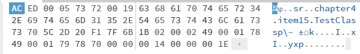

클래스와 멤버의 접근 권한을 최소화하라
## 정보 은닉
- 컴포넌트를 잘 설계했는지를 판가름 내는 것은 "얼마나 `정보 은닉`이 잘 이뤄져있는가?" 임
	- 즉, 클래스 `내부 데이터`와 `내부 구현 정보`를 외부로부터 완벽히 숨겨, **`구현`과 `API`를 깔끔히 `분리`** 한 컴포넌트가 `잘 설계된 컴포넌트`라는 것임
		- 이들은 오직 `API`를 통해 `서로 소통`하고, 서로의 *내부 동작에는 의존하지 않음*
	- 이것이 소프트웨어 설계에서 근간이 되는 `정보 은닉`(또는 `캡슐화`)이라는 개념
### 정보 은닉의 장점
- 정보 은닉은 `시스템을 이루는 컴포넌트들`을 서로 `독립(디커플링)`시킬 수 있게 해줌
	- 이로 인해 `개발`, `테스트`, `최적화`, `적용`, `분석`, `수정`을 개별적으로 수행할 수 있게 됨
#### 시스템 개발 속도 증가
- 여러 컴포넌트를 `병렬로 개발`할 수 있어 개발 속도가 증가함
#### 시스템 관리 비용 절감
- 컴포넌트의 더 빠른 파악과, 다른 컴포넌트에 영향을 끼치지 않고 디버깅 및 교체할 수 있게 됨
#### 성능 최적화 도움
- *정보 은닉을 통해* `컴포넌트 간 독립`이 가능해지므로 얻을 수 있는 이점
- *시스템 구축 이후* 프로파일링을 통해 `성능 문제를 일으키는 컴포넌트`를 `파악`한 뒤 *다른 컴포넌트에 영향을 주지 않고* `문제 컴포넌트만 최적화`할 수 있음
#### 소프트웨어 재사용성 향상
- `낮은 결합도`를 갖는 `컴포넌트`는 컴포넌트가 개발된 환경이 아닌, 다른 환경에서도 유용한 경우가 많기 때문
#### 대형 시스템 개발 위험 감소
- 시스템 전체가 구축되지 않은 상황이더라도, `개별 컴포넌트`들은 완성 및 검증이 가능하기 때문
### Java에서의 정보 은닉
- Java에서는 `정보 은닉`을 위해 여러 장치를 제공
- 그 중, [접근 제어 메커니즘](https://docs.oracle.com/javase/specs/jls/se7/html/jls-6.html#jls-6.6)은 `클래스`, `인터페이스` 및 `멤버`의 `접근성`을 지정
	- 각 `엔티티`의 `접근성`은 `선언된 위치`와 선언에 명시된 `접근 제한자(private, protected, public)`로 결정됨
	- 이러한 `접근 제한자`를 적절히 활용하는 것이 정보 은닉에 필수적임
- 기본 원칙은 간단함; **각 `클래스` 및 `멤버`들을 *가능한* `접근이 불가능`하도록 만들 것**
	- 즉, *소프트웨어가 적절하게 동작할 수 있는 한* **`가장 낮은 접근 수준을 지정`** 해야 함
### 접근 수준 지정 규칙
#### 클래스 / 인터페이스
- **최상위(어떤 것에도 중첩되지 않은)** `클래스 및 인터페이스`의 경우, `package-private`와 `public` 두 가지의 접근 수준을 지정할 수 있음
	- `public`으로 선언시 `공개 API`, 그렇지 않은 경우 패키지 내부에서 사용할 수 있음
	- `package-private`로 설정할 경우 *API로 공개되는 것이 아닌*, `내부 구현의 일부`로서 `동작`하기 때문에 향후 *기존 클라이언트에게 피해를 주지 않고* `수정`, `교체`, `제거`가 가능해짐
	- 반면 `public`으로 설정해 API로 만들 경우, `호환성을 유지`하기 위해 영원히 지원 및 관리해주어야 함
- *한 클래스에서만 사용*되는 `최상위 package-private 클래스/인터페이스`가 있다면, *이를 사용하는 클래스의* `private static` 클래스로 만드는 것도 고려해볼만함
	- 이렇게 하면 `"패키지 내 모든 클래스"` -> `"이를 사용하는 한 클래스"`로 접근성이 줄어듦
- 또한, `public` 클래스의 경우 꼭 `public`일 필요가 없다면, `package-private` 수준으로 접근성을 줄여, `패키지의 API`가 아닌 `내부 구현의 일부`로 만드는 것이 나음
#### 멤버
- `멤버`(`필드`, `메서드`, `중첩 클래스/인터페이스`)에 대해 부여할 수 있는 접근 수준은 네 가지이며, 접근성이 높아지는 순서대로 아래와 같음
- `private`
	- 멤버를 선언한 `최상위 클래스`에서만 접근 가능
- `package-private`
	- 멤버가 선언된 패키지 내부의 모든 클래스에서 접근 가능
	- `디폴트` 제어자라고도 불리며, *`접근 제한자`를 지정하지 않은 경우* 적용되는 `접근 수준`
		- **단, `인터페이스 멤버`의 경우** 기본적으로 `public`임
- `protected`
	- `package-private`의 접근 범위 뿐만 아니라, *멤버가 선언된 클래스의* `하위 클래스`에서도 접근할 수 있음
		- 다만, [약간의 제약](https://docs.oracle.com/javase/specs/jls/se7/html/jls-6.html#jls-6.6.2)이 따름
			- 예시) `protected` 멤버를 가진 클래스 `C`와 `C`의 하위 클래스인 `S`, 그리고 *인스턴스 필드 또는 메서드*를 가리키는 `Id`가 있다고 가정
				- 만약 `Q.Id`와 같은 형태로 접근시, `Q`의 타입이 `S` 또는 `S의 하위 클래스`일때만 접근이 허용됨
					- `Q`는 [표현식 이름(ExpressionName)](https://docs.oracle.com/javase/specs/jls/se14/html/jls-6.html#jls-6.5.6)으로, 이는 *스코프 내* `지역 변수`, `형식 매개 변수(Formal Parameter, 함수 선언시 함수 내부에서 사용되는 매개변수)`, `필드`를 뜻함
				- 만약 `E.Id`와 같은 형태로 접근하거나 `E.Id(...)`(만약 Id가 메서드인 경우)와 같은 형태로 메서드 호출시, `E`의 타입이 `S` 또는 `S의 하위 클래스`일때만 접근이 허용됨
					- `E`는 [기본 표현식(Primary Expression)](https://docs.oracle.com/javase/specs/jls/se7/html/jls-15.html#jls-15.8)으로, 이는 `리터럴`, `클래스 리터럴`, `this`, `클래스 인스턴스 생성 표현식`, `필드 액세스`, `메서드 호출`, `배열 액세스`, `괄호로 묶인 표현식` 을 포함하는 **`가장 단순한 종류의 표현식`** 을 뜻함
			- 또한, `protected 생성자`에 대해서도 다음과 같은 제약이 존재
				- `protected`로 선언된 생성자를 가진 클래스 `C`와 이를 사용하는 선언이 존재하는 `가장 내부(innermost)`의 클래스 `S`가 있다고 가정
				- `super(...)` 또는 `E.super(...)`(`E`는 `기본 표현식`)을 통해 접근하는 경우 허용됨
				- `익명 클래스 인스턴스 생성 표현식`인 `new C(...){...}` 또는 `정규화된 클래스 인스턴스 생성 표현식`인 `E.new C(...){...}`(`E`는 `기본 표현식`)을 통한 접근인 경우 허용됨
				- 반면, `new C(...)` 또는 `E.new C(...)`의 경우 `접근이 허용되지 않음`
					- `protected 생성자`는 `생성자가 정의된 패키지 내`에 작성된 (*익명 클래스를 선언하지 않는*) 클래스 인스턴스 생성 표현식을 통해 접근할 수 있음
- `public`
	- `모든 곳에서 접근`할 수 있음
#### 유의 사항
##### 클래스의 공개 API 설계 후, 이외의 모든 멤버들은 `private`으로 만들 것
- 이후 만약 `같은 패키지의 다른 클래스`에서 접근해야 하는 경우에만 멤버의 `private` 키워드를 제거해 `접근성을 완화`할 것
	- 만약 이러한 일이 잦을 경우, *시스템 설계를 재검토해* `컴포넌트`를 `더 분해할 수 있는지 확인`할 것
- `private` 및 `package-private` 멤버는 `클래스의 구현`에 해당하므로, 보통 `공개된 API`에 *영향을 주지 않음*
	- 단, `Serializable`을 구현한 클래스의 경우, `필드들`이 `공개된 API`를 통해 `유출`될 수 있음
		- 직렬화된 `바이트 스트림 인코딩`도 하나의 공개 API가 되며, 만약 *Java의 기본 방식을 쓸 경우* 직렬화된 형태는 클래스의 `기본 내부 구현`에 영원히 묶이게 됨
###### 바이트 스트림 인코딩 분석
```java
class TestClass implements Serializable {
	private int x = 20;
	protected int y = 30;
}
```
- 위 클래스를 파일로 복호화 한 뒤, https://hexed.it/ 와 같은 hex 값 분석 사이트를 사용
- 이때, hex 값은 다음과 같이 나옴
	- 
		- 이는 해석하면 다음과 같음
			- `ы sr` (`AC ED`) - Java 직렬화의 매직 넘버 및 버전 표시
			- `sr` (`73 72`) - TC_SERIALIZATION 헤더 표시
			- `chapter4.item15.TestClass` - 클래스의 전체 이름
			- `p\- ?k` - 직렬화 버전 UID (SerialVersionUID)
			- `I x` - int 타입의 필드 `x` 선언
			- `I y` - int 타입의 필드 `y` 선언
			- `xp` - TC_NULL 또는 블록 끝 표시
				- `xp`(`78 70`) 이후의 값은 `x`와 `y`필드의 값인데, 각각 `14`(20), `1E`(30)임을 알 수 있음
- 즉, `private`으로 선언한 멤버의 값도, 직렬화를 거치게 되면 알 수 있음
##### `protected 멤버`의 수는 적을수록 좋음
- `public 클래스`의 멤버를 `package-private`에서 `protected`로 바꿀 경우 *해당 멤버에 `접근 할 수 있는 대상`* 의 **범위가 대폭 넒어짐**
- 또한 `public 클래스`의 `protected 멤버` 는 `공개된 API`의 일부이므로 영원히 지원되어야 함
- 그리고 `protected 멤버`는 내부 구현 사항에 대한 `공개적인 약속`이라고 할 수 있음
	- 따라서 이로인해 개발자는 `protected 멤버`에 대한 `유지보수를 지원`해야하고, 클라이언트가 `내부 구현에 의존`하는 등의 문제가 발생할 수 있음
##### `리스코프 치환 원칙`으로 인한 `멤버 접근성 좁히기 제약`
- `상위 클래스의 메서드`를 `재정의`할 때, `접근 수준`을 상위 클래스의 것보다 `좁게 설정할 수 없음`
	- *이를 지키지 않으면* 하위 클래스를 컴파일할 때 `컴파일 오류`가 `발생`
- 다만, `클래스`가 `인터페이스를 구현`하는 것은 이러한 규칙의 특별한 케이스로, `인터페이스에 정의된 모든 메서드`는 클래스에서 `public`으로 선언해야 함
##### `테스트를 목적`으로 한 `접근성 완화`는 적정 수준까지만 할 것
- 가령 `public 클래스`의 `private 멤버`를 `package-private`까지 넓히는 것은 허용되지만, 그 이상은 허용되지 않음
- `테스트 코드`를 테스트 `대상이 속한 패키지`에 두어 접근하도록 하는것이 나음
##### `public 클래스`의 `인스턴스 필드`는 `public이 아닌것`이 좋음
- `final`이 아니거나 `가변 객체를 참조`하는 `인스턴스 필드`를 `public`으로 선언할 경우, *필드에 저장될 값을* `제한할 수 있는 능력`을 **잃게 됨**
	- 즉, 필드와 관련된 것들에 `불변성`을 `강제(보장)할 수 없게 됨`
- 또한, *필드가 수정될 때* `조치를 취할 수 있는 능력`(ex. 락 획득)을 잃게되므로 `public 가변 필드`가 있는 클래스는 일반적으로 `thread-safe`하지 않음
- 설령 필드가 `final`이고 `불변 객체`를 `참조`하고 있는 경우에도, 필드가 `public`으로 공개되어 있기 때문에 추후에 *해당 필드를 사용하지 않는* `새로운 내부 구현`으로 변환할 수 있는 `유연함을 잃게 됨`
##### 정적 필드를 `public`으로 공개하는 것은 "클래스의 `추상 개념을 형성`하는데 필요한 **`상수`**"일 경우에만 괜찮음
- 위 경우, `상수`를 `public static final`로 공개하며 해당 필드는 반드시 `원시 타입 값` 또는 `불변 객체`를 참조해야 함
	- 만약 `가변 객체`를 `참조`한다면 상기했던 `final`이 아닌 필드의 모든 단점들을 갖게 됨
	- *참조를 수정할 순 없지만*, `참조된 객체`는 `수정할 수 있기 때문`
##### 클래스에서 `public static final 배열 필드`를 두거나, 이를 반환하는 `접근자 메서드`를 제공하지 말 것
- *길이가 0이 아닌* 배열은 모두 **`변경 가능`** 하기 때문
- 따라서 아래와 같은 코드가 있다면, 클라이언트에서 해당 배열에 접근해 내용을 수정할 수 있음
```java
	public static final Thing[] VALUES = { ... };
```
- 해결책
	1. `배열`을 `private`으로 선언하고, 이를 기반으로 하는 `public 불변 리스트`를 추가
	```java
	private static final Thing[] PRIVATE_VALUES = { ... };
	public static final List<Thing> VALUES = Collections.unmodifiableList(Arrays.asList(PRIVATE_VALUES));
	```
	2. `배열`을 `private`으로 선언하고, 그 **`복사본`을 `반환`** 하는 `public 메서드`를 추가(방어적 복사)
	```java
	private static final Thing[] PRIVATE_VALUES = { ... };
	public static final Thing[] values() {
		return PRIVATE_VALUES.clone();
	}
	```
### 모듈 시스템과 함께 추가된 암묵적 접근 수준
- Java 9에서 추가된 [모듈](https://www.oracle.com/corporate/features/understanding-java-9-modules.html)은 패키지 및 리소스를 그룹으로 묶은 개념
- `모듈`은 속한 패키지 중 `공개할 패키지`를 `명시적으로 선언`할 수 있음
	- 관례상 `module-info.java`라는 소스 파일에 포함
	```java
	// 예시
	module core {
		// 현재 모듈에서 필요한 다른 모듈, 즉 종속성을 지정
		requires java.base;
		// 공개할 패키지 지정
		exports org.eclipse.stuff;
	}
	```
- `export`로 *지정하지 않은* 패키지의 `public` 및 `protected` 멤버는 `모듈 외부`에서 `접근할 수 없음`
	- 또한, 모듈 내부에서는 `export 선언 유무`는 `접근성에 아무런 영향`을 주지 않음
- 모듈을 통해, 클래스의 *외부 공개 없이* 같은 `모듈 내 패키지 간`의 자유로운 `클래스 공유`가 가능해짐
	- 이때, *공개되지 않은 패키지*의 `public 클래스`의 `public` 및 `protected` 멤버들은 일반적인 `public` 및 `protected` 수준과 유사한 **`암묵적 접근 수준`** 을 가짐
	- 다만, 이러한 형태의 공유가 *필요한 경우는 드물며*, *패키지 간* `클래스의 재배치`로 해결할 수 있음
- 이 `암묵적 접근 수준`은 *기존의 접근 수준들과 달리* 주의가 필요
	- `모듈의 JAR 파일`을 *`모듈 경로` 대신* 애플리케이션의 `classpath`에 배치하면, 모듈 내부의 패키지들은 `모듈이 없는 것처럼` 동작
	- 즉, `패키지`가 모듈에 의해 `export되었는지` 여부와 관계 없이 `public 클래스`의 모든 `public` 및 `protected` 멤버는 `모듈 외부에서 접근`할 수 있게 됨
	- 이러한 `접근 수준`은 `JDK`에서 엄격하게 적용되고 있는데, `Java 라이브러리`에서 `공개하지 않은 패키지`들은 해당 모듈 밖에서 접근할 수 없는 것이 그 예시
- 이외에도 모듈은 여러 번거로운 작업들이 필요하며, 이러한 개념이 널리 받아들여질지도 의문
	- 패키지를 `모듈 단위로 그룹화`하고, `모듈 선언`에 `패키지들의 모든 종속성을 명시`해야 함
	- 그리고 `소스트리의 재정렬`과 모듈 내부에서 *모듈화되지 않은 패키지*로의 `접근`에 대한 `특별한 조치`가 필요
# 핵심 정리
- 프로그램 요소의 `접근성`은 `가능한 최소화`하라
- 필요한 것들로만 이뤄진 최소한의 `public API`를 설계하자
	- 그 외에는 `클래스`, `인터페이스`, `멤버`가 *의도치않게* `API로 공개되지 않도록`하자
- `public 클래스`는 `상수`로 사용할 `public static final 필드`외에는 어떠한 `public 필드`도 `가져서는 안 됨`
	- 또한, `public static final` 필드가 `참조하는 객체`가 `불변 객체`인지 확인할 것
