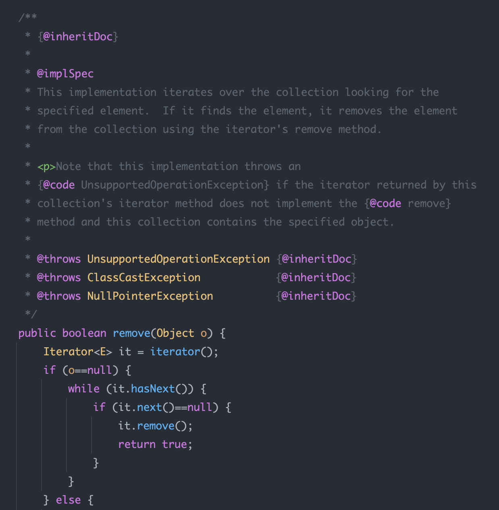
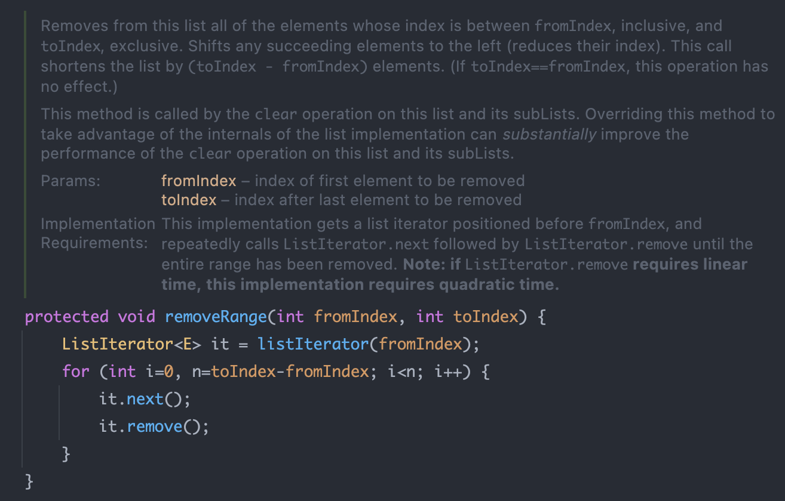

# 상속을 고려해 설계하고 문서화하라. 그러지 않았다면 상속을 금지하라

> - 상속용 클래스는 재정의할 수 있는 메서드들을 내부적으로 어떻게 이용하는지 문서로 남겨야 한다.
> - 클래스의 API로 공개된 메서드에서 클래스 자신의 또 다른 메서드를 호출할 수도 있다.
> - 또한 그 메서드가 재정의 가능 매서드(protected, public 중 final이 아닌 모든 메서드)라면 그 사실을 호출하는 메서드의 API 설명에 직시해야 한다.

 

> - API 문서의 메서드 설명 끝에 `Implementation Requirements`로 시작하는 절이 있다.
>   - 그 메서드의 내부 동작 방식을 설명하는 곳
>   - 메서드 주석에 `@implSpec` 태그를 붙여주면 자바독 도구가 생성해준다.
>   - 해당 설명에 따르면 `iterator` 메서드를 재정의하면 `remove`메서드에 영향을 준다는 점을 알 수 있다.

## protected 공개
> 내부 메커니즘을 문서로 남기는 것만이 상속을 위한 설계의 전부는 아니다. 효율적인 하위 클래스를 어려움 없이 만들 수 있게 하려면 클래스 내부 동작 과정 중간에 끼어들 수 있는 훅을 잘 선별하여 `protected` 메서드 형태로 공개해야할 수도 있다.

> - `java.util.Abstract`의 `removeRange`메서드이다. List의 구현체의 최종 사용자는 해당 메서드에 관심이 없다.
>   - 그럼에도 이 메서드를 제공한 이유는 단지 하위 클래스에서 부분리스트의 clear 메서드를 고성능으로 만들기 쉽게 하기 위해서다.
> - 해당 메서드가 없다면 하위 클래스에서 clear 메서드를 호출했을 때, 제거할 원소의 제곱에 비례해 성능이 느려지거나 부분리스트의 메커니즘을 새로 구현해야 했을 것이다.

### 그렇다면 상속용 클래스를 설계할 때 어떤 메서드를 protected로 노출해야 할지는 어떻게 결정할까?
> - 심사숙고해서 잘 예측한 다음, 실제 하위 클래스를 만들어서 시험해보는 것이 최선이자 유일하다.
> - 꼭 필요한 protected 멤버를 놓쳤다면 하위 클래스를 작성할 때 그 빈자리가 확연히 드러난다.
>   - 즉 `private`한 멤버를 하위 클래스로 생성하다보면 성능 상의 이슈등으로 `protected`로 변경하는 경우가 잦다.

## 상속용 클래스의 생성자는 재정의 기능 메서드를 호출해서는 안된다.
> 상위 클래스의 생성자는 하위 클래스의 생성자보다 먼저 실행된다. 따라서, 상위 클래스에서 재정의될 메서드를 호출하는 경우 오동작할 수 있다.

> - [Parent.java](Parent.java)
> - 현재 시간을 두 번 출력하라는 것을 기대했지만, 첫 번째 결과는 `null`이 출력된다. 그 이유는 모든 클래스는 상위 클래스의 생성자를 먼저 호출하기 때문이다.
> - 단 `private`, `final`, `static` 등의 메서드는 재정의가 불가능하기 때문에 생성자에서 안심하고 호출해도 된다.

> - [Super.java](Super.java)
> - 자바에서는 모든 자식의 생성자들은 `super()`가 생략되어 있다. `Main` 클래스에서 매개변수가 있는 자식 인스턴스를 생성하면, 부모에도 매개변수가 있는 생성자를 호출할 것 같지만, 기본 생성자를 호출한다.
>   - 매개변수가 있는 부모를 호출하고 싶은 경우 직접 명시를 통해 해결할 수 있다.

## Cloneable과 Serializable 인터페이스는 상속 시 주의하자
> - `clone`과 `readObject` 메서드는 새로운 객체를 만드는 생성자와 비슷한 효과를 낸다.
> - 따라서 상속용 클래스에서 해당 인터페이스를 구현한다면, clone과 readObject에서 재정의 가능 메서드를 호출해서는 안된다.

> - readObject의 경우 하위 클래스가 역직렬화되기 전에 재정의한 메서드부터 호출하게 된다. clone의 경우 하위 클래스의 clone 메서드가 복제본의 상태를 수정하기 전에 재정의한 메서드를 호출하게 된다.
> - 즉, 어느 쪽이든 프로그램의 오작동으로 이어질 수 있다.

> - Serializable을 구현한 상속용 클래스가 `readResolve`나 `writeReplace`메서드를 갖는다면, 이들은 private이 아닌 protected로 선언해야 하위 클래스에서 재정의할 수 있다.

## 정리
> - 상속용 클래스를 설계하는 데에는 복잡한 과정이 있다. 따라서 클래스 내부에서 스스로를 어떻게 사용하는지 모두 문서로 남겨야 한다.
> - 효율 좋은 하위 클래스를 만들 수 있도록 일부 메서드를 `protected`로 제공하는 경우도 있다.
>   - 상속용으로 설계한 클래스는 배포 전에 반드시 하위 클래스를 만들어 검증한다.
> - 클래스를 확장해야할 명확한 이유가 없다면 상속을 금지하는 편이 낫다. 이 때는 클래스를 `final`로 선언하거나 생성자 모두를 외부에서 접근할 수 없도록 package-private나 private하게 만들고 public 정적 팩터리를 만들어주는 방법이 있다.
> - 상속용 클래스의 생성자는 재정의 가능 메서드를 호출하면 안된다.
> - Cloneable과 Serializable 인터페이스를 상속용 클래스에서 구현한다면 주의하자.