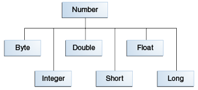

# ITEM31. 한정적 와일드카드를 사용해 API 유연성을 높이라
## 매개변수화 타입은 불공변(invariant)이다.
- Type1이 Type2의 하위 타입이어도, `List<Type1>`이 `List<Type2>`의 하위 타입도 상위 타입도 아니다.
- 이와 같이, `List<String>`은 `List<Object>`의 하위 타입이 아니다.
  - `List<Object>`에는 어떤 객체든 넣을 수 있지만, `List<String>`에는 문자열만 넣을 수 있다.
  - `List<String`은 `List<Object>`가 하는 일을 제대로 수행하지 못하니 하위 타입이 될 수 없다.
    - 리스코프 치환 법칙
- 이렇기 때문에 불공변 방식보다 유연한 방식이 필요하다.
  - Stack 참고
- 

## 한정적 와일드카드 타입
- pushAll의 입력 매개변수 타입은 'E의 Iterable'이 아니라 'E의 하위 타입의 Iterable'이어야 한다.
  - Number -> Integer
  - `Iterable<? extends E>`
- popAll의 출력 매개변수 타입은 'E의 Collection'이 아니라 'E의 상위 타입의 Collection'이어야 한다.
  - Number -> Object
  - `Collection<? super E>`
- 유연성을 극대화하려면 원소의 생산자나 소비자용 입력 매개변수에 와일드카드 타입을 사용하라.
- 입력 매개변수가 생산자와 소비자 역할을 동시에 한다면 와일드카드 타입을 써도 좋을 게 없다.
  - 타입을 정확히 지정해야 하는 상황으로, 이때는 와일드카드 타입을 쓰지 말아야 한다.
  - 와일드카드 타입을 써야할 때
    - 펙스(PECS) : producer-extends, consumer-super
    - 매개변수화 타입 T가 생산자라면 `<? extends T`를 사용하고, 소비자라면 `<? super T>`를 사용하라.
      - Stack에서는 pushAll의 src 매개변수는 Stack이 사용할 E 인스턴스를 생산하므로 `Iterable<? extends E>`를 사용했다.
      - popAll의 dst 매개변수는 Stack에 넣을 E 인스턴스를 소비하므로 `Collection<? super E>`를 사용했다.
    - Chooser, Union 참고

## 타입 매개변수와 와일드 카드
- 공통되는 부분이 있어서, 메서드를 정의할 때 둘 중 어느 것을 사용해도 괜찮을 때가 많다.
```java
public static <E> void swap(List<E> list, int i, int j);
public static void swap(List<?> list, int i, int j);
```
- public API라면 간단한 두 번째가 낫다.
  - 어떤 리스트는 두 번째 메서드에 넘기면 명시한 인덱스의 원소들을 교환해 준다.
  - 신경 써야할 타입 매개변수도 없다.
- 메서드 선언에 타입 매개변수가 한 번만 나오면 와일드카드로 대체하라.
  - 비한정적 타입 매개변수는 비한정적 와일드카드로 바꾸고,
  - 한정적 타입 매개변수는 한정적 와일드카드로 바꿔라

## 정리
> 조금 복잡하더라도 와일드카드 타입을 적용하면 API가 훨씬 유연해진다.
> </br> PECS 공식을 기억하자.
> </br> 생산자(producer)는 extends를 소비자(consumer)는 super를 사용한다.
> </br> Comparable과 Comparator는 모두 소비자라는 사실을 기억하자.