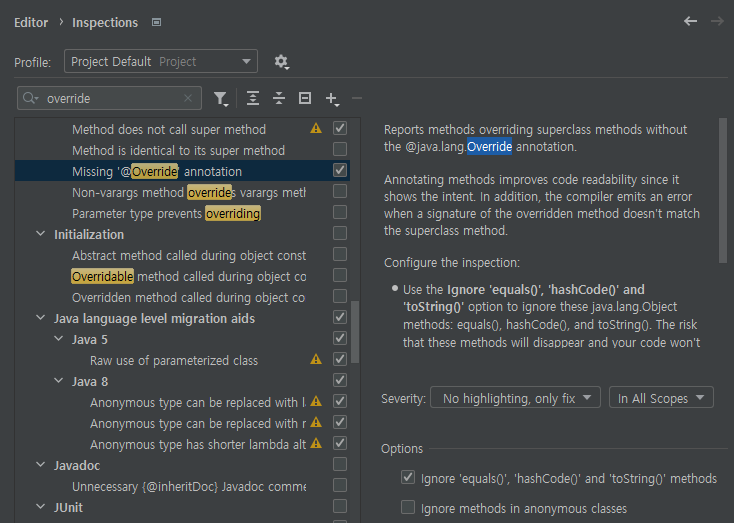

`@Override` 애너테이션을 일관되게 사용하라
## `@Override` 애너테이션
Java에서 기본으로 제공되는 애너테이션으로, **메서드 선언**에만 달 수 있다.  
이 애너테이션이 달린 메서드는 ***상위 타입*의 메서드**를 **재정의**했음을 뜻한다.  
`@Override` 애너테이션을 일관적으로 사용하면, 여러 잘 알려진 버그들을 예방할 수 있다.  
### 예시 - `equals()` 재정의하기
영어 알파벳 2개를 필드로 갖는 **Bigram**이라는 클래스를 예시로 들자.  
해당 클래스에서 equals를 재정의 하고싶어 다음과 같이 메서드를 작성했다.  
```java
public class Bigram {  
    private final char first;  
    private final char second;
	...
	public boolean equals(Bigram b) {  
	    return b.first == first && b.second == second;  
	}
}
```
작성자의 의도는 '`Object`의 `equals()`를 재정의하는 것'이었지만, 실제로는 다른 시그니처를 가진 별개의 equals를 정의하는, 즉 `오버로딩(Overloading)`을 하게 되었다.  
`Object`의 `equals()`는 인수로 `Object`를 받기 때문이다.  
이는 ***별 다른 오류**를 개발자에게 표시해주지 않아* 기능이 정상적으로 동작하지 않음을 **알 수 없다**.  
이때, `@Override` 애너테이션을 붙인 뒤 똑같은 방식으로 재정의하려고 시도하면 자바 컴파일러는 **컴파일 오류**를 **발생**시킨다.  
```java
...
// Error: Method does not override method from its superclass
@Override  
public boolean equals(Bigram o) {  
    return first == o.first && second == o.second;  
}
```
따라서, 상위 클래스의 메서드를 *재정의하려하는 모든 메서드*에 **`@Override` 애너테이션을 달자**.  
### `@Override`를 달지 않아도 되는 경우
구체 클래스에서 상위 클래스의 *`추상 메서드`를 재정의*할 때는 굳이 `@Override`를 달지 않아도 된다.  
구체 클래스에 아직 구현하지 않은 추상 메서드가 있으면 자바 컴파일러가 바로 알려주기 때문이다.  
```java
// Class 'B' must either be declared abstract or implement abstract method 'abs(int)' in 'A'
public class B extends A{  
  
}
abstract class A {  
    abstract public int abs(int i);  
}
```
## IDE 활용하기
사용하는 IDE에서 관련 설정을 활성화하면, `@Override` 가 달려있지 않지만 실제로 재정의를 하고있다면 경고하므로써 `@Override`를 *일관되게 사용*할 수 있도록 해준다.  
### 예시 - Intellij에서 제공하는 옵션
  
일례로 Intellij에서는 `@Override` 애너테이션 없이 상위 클래스의 메서드를 재정의하고 있는 메서드를 알려주는 옵션이 있다.  
추가로, `equals()`, `hashCode()`, `toString()`와 같은 `Object`의 다른 메서드들에 대해서도 적용할 수 있다.  
### 인터페이스의 메서드를 재정의하는 경우
인터페이스에서 `디폴트 메서드`를 지원하기 시작하면서, 인터페이스 메서드를 구현하는 메서드에도 `@Override`를 달아준다면 **시그니처가 올바른지 재확인**할 수 있으므로 좋다.  
만약 implement하려는 인터페이스에 *디폴트 메서드가 없음*을 안다면 `@Override`를 생략해 **코드를 깔끔**하게 할 수 있지만, `추상 클래스 또는 인터페이스`에서는 *상위 클래스 또는 상위 인터페이스의 메서드*를 재정의할 때 `@Override`를 달아주는것이 좋다.  

# 핵심 정리
---
- 재정의한 모든 메서드에 `@Override`를 다는 습관을 들이면, 재정의하다 실수했을때 컴파일러가 바로 알려줄 수 있다.  
	- 만약 **구체 클래스**에서 *상위 클래스의 추상 메서드*를 재정의한다면, 굳이 달지 않아도 되지만 단다고 해서 안 될건 없다.
