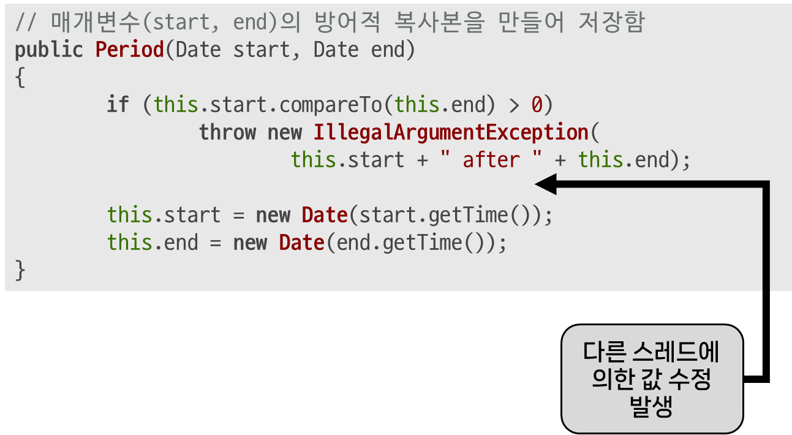

적시에 방어적 복사본을 만들어라
## 자바의 보안
- C/C++과 달리 *`네이티브 메서드`를 쓰지 않아* (메모리적으로) `자바는 안전함`
	- `버퍼 오버런`, `배열 오버런`, `와일드 포인터`와 같은 `메모리 충돌 오류` 발생 X
		- `버퍼 오버런`: 
		- `배열 오버런`: 
		- `와일드 포인터`: 
	- 이는 해당 언어들이 메모리를 하나의 큰 배열(연속된 시퀀스)로 다루기 때문
## 그럼에도 방어적인 프로그래밍은 필요함
- 악의적이든, 실수로든 클래스를 오작동시키지 못하도록 보호할 수 있어야 함
### 예시 - 가변 객체로 인한 내부 수정
```java
// 불변식이 깨져버린 "기간(time period)"을 표현하는 클래스
public final class Period {
	private final Date start;
	private final Date end;
	/**
	* @param start 기간의 시작 시간
	* @param end 기간의 종료 시작. 시작 시간보다 이후여야 함
	* @throws IllegalArgumentException 시작이 종료보다 늦을 때
	* @throws NullPointerException 시작 또는 종료가 null일때
	*/
	public Period(Date start, Date end) {
		if (start.compareTo(end) > 0)
			throw new IllegalArgumentException(
				start + " after " + end);
		this.start = start;
		this.end = end;
	}
	public Date start() {
		return start;
	}
	public Date end() {
		return end;
	}
	... // 기타 코드 생략
}
```
- 일반적으로 외부에서 (*객채의 허락 없이*) 내부를 수정하는 일은 불가능
- 위 클래스에서는 가변인 `Date` 객체를 인자로 받은 값 그대로 사용하여, 내부를 수정할 수 있게 됨
	```java
	// Period 인스턴스의 내부 공격하는 코드
	Date start = new Date();
	Date end = new Date();
	Period p = new Period(start, end);
	end.setYear(78); // p의 내부 수정
	```
	- 따라서 위처럼 *불변식을 검사하는 부분(생성자)* 을 통과한 뒤 내부 값을 수정해 불변식을 깨뜨림
#### 해결법?
- Java 8에 등장한 [Instant](https://docs.oracle.com/javase/8/docs/api/java/time/Instant.html) (또는 [LocalDateTime](https://docs.oracle.com/javase/8/docs/api/java/time/LocalDateTime.html), [ZonedDateTime](https://docs.oracle.com/javase/8/docs/api/java/time/ZonedDateTime.html)를 사용하면 됨
- 하지만 `Date`와 같이 `낡은 가변 값 타입`은 `여전히` *여러 API와 내부 구현에* `잔존`하고 있음
## 방어적 복사
- 위와 같은 사례에서, 클래스 내부를 보호하려면 *외부로부터 (생성자, 메서드 등을 통해)받은* `가변 객체`들을 `방어적으로 복사(Defensive Copy)`해야 함
### 수정한 예시
```java
// 매개변수(start, end)의 방어적 복사본을 만들어 저장함
public Period(Date start, Date end) {
	this.start = new Date(start.getTime());
	this.end = new Date(end.getTime());
	
	if (this.start.compareTo(this.end) > 0)
		throw new IllegalArgumentException(
			this.start + " after " + this.end);
}
```
- 이전의 예시에 `방어적 복사`를 도입한 코드
	- 하지만 위 코드에도 `3가지 공격`에 대한 `허점`이 존재함
	- 이들을 보완하면, `네이티브 메서드`, `리플렉션`과 같이 *`언어 외적인 수단` 없이*는 **`불변식`을 위배할 수 없음**
#### 공격 1 - `유효성 검사 시점`에 따른
- `매개변수의 유효성 검사` **이전**에 `방어적 복사`를 수행한 뒤, `복사본`에 대해 **`유효성 검사를 수행`** 함
	
	- 이는 `멀티스레딩 환경`에서 `원본 객체의 유효성 검사` - `복사본 생성`으로 이어지는 흐름 사이의 찰나에 `다른 스레드가 원본을 수정`하는 `위험`을 `방지`
	- 이러한 공격을 `검사시점/사용시점(time-of-check/time-of-use) 공격(또는 TOCTOU 공격)` 이라고 함
#### 공격 2 - `clone` 메서드 호출에 따른
```java
class MaliciousDate extends Date {
	public MaliciousDate(long time, List<Date> list) {
		super(time);
		list.add(this);
	}
	public Object clone() {
		// ...
	}
}

// 클라이언트의 코드
public static int someWhere()
{
	List<Date> list = new ArrayList<Date>();
	MaliciousDate start = new MaliciousDate(120301230L, list);
	MaliciousDate end = new MaliciousDate(120301280L, list);
	
	Period p = new Period(start, end);
	list.get(0).setYear(33);
}
```
- `Date`가 *`final 클래스`가 아니기 때문에* `악의적인 하위 클래스`에서 작성한 `clone`이 *신뢰 할 수 없는* `하위 클래스의 인스턴스`를 반환할 수 있음
- 이러한 하위 클래스는 *각각 인스턴스에 대한 참조*를 `private static 리스트`에 담아 두었다가, `공격자`가 `해당 목록에 접근`하도록 `허용`할 수 있음
- 따라서, `매개변수`가 *신뢰할수 없는 타인에 의해* `확장될 수 있는 타입`이라면 `방어적 복사`에 **`clone을 사용해선 안 됨`**
#### 공격 3 - 접근자 메서드로 인한 내부 가변 필드 직접 노출
```java
	Date start = new Date();
	Date end = new Date();
	Period p = new Period(start, end);
	p.end().setYear(78);
```
- `접근자 메서드`인 `start()`, `end()`를 통해 내부 가변 필드가 `직접적으로 드러남`
- 이를 방지하기 위해서는 `접근자 메서드`에서 `가변 필드`의 `방어적 복사본`을 반환해야 함
	```java
	public Date start() {
		return new Date(start.getTime());
	}
	public Date end() {
		return new Date(end.getTime());
	}
	```
	- 추가로, 위 코드에서는 `clone()`을 사용해도 됨
		- `Period`가 갖고있는 `Date 객체`는 `java.util.Date`임이 확실하기 때문
		- 다만, *웬만하면* `인스턴스 복사`시에는 `생성자`, `정적 팩터리`를 쓰는게 `좋음`
### 방어적 복사 사용을 고려해야 하는 경우
#### 클라이언트 측 가변 객체를 저장해야 할 때
- *불변 객체를 만드는 것*외에도 `클라이언트가 제공한 객체 참조`를 `내부 자료구조에 저장`해야할 경우, `해당 객체가 잠재적으로 변경될 수 있는지` 고려해야 함
	- 만약 `건네받은 객체`가 변경될 시 `클래스의 동작`에 *문제가 생길 수 있다면* `복사본을 만들어 저장`해야 함
		- ex) `클라이언트로부터 받은 객체`를 내부의 `Set에 저장`하거나, `Map의 키`로 사용시 추후 그 객체가 변경될 경우 `Set`/`Map`의 `불변식`이 `깨질 수 있음`
#### 내부 가변 객체를 클라이언트에게 건네줄 때
- 반대로, `가변인 내부 객체`를 `클라이언트에게 건네줄 때`도 이를 고려해야 함
	- 안심할 수 없다면, `방어적 복사본`을 반환할 것
#### 내부 배열을 반환해야 할 때
- `길이 1 이상의 배열`은 `가변`이므로, *클라이언트에게 건네줄 때* `방어적 복사를 수행`해야 함
- 또는, `배열의 불변 뷰`(ex. `Collections.unmodifiableList`)를 반환할 수도 있음
### 방어적 복사를 고려하지 않아도 되는 경우
- `방어적 복사`는 `성능 저하`가 따르고, *항상 쓸 수 있는 방법이 아님*
#### 호출자가 컴포넌트 내부를 수정하지 않을 것임이 확실한 경우
##### 신뢰되는 환경인 경우
- 가령 *같은 패키지에서 사용*되는 등 `신뢰되는 환경`이라면 `방어적 복사`를 `생략`할 수 있음
##### 클라이언트를 신뢰할 수 있는 경우
- *메서드/생성자로 객체를 넘기는 것*은 **`객체의 통제권`** 을 `넘김`을 의미
	- 따라서 이를 호출하는 클라이언트는 `더 이상 해당 객체를 수정할 일이 없다`고 `약속`해야 함
#### 불변식이 깨져도 영향이 클라이언트로 한정될 경우
- `래퍼 클래스 패턴(item 18)`과 같이, 여전히 `넘긴 객체에 접근`할 수 있어 `불변식을 파괴`할 수 있지만 그 영향이 `클라이언트 자신`에게만 국한될 경우
### 대안 - 가능한 불변 객체를 사용할 것
- 이전(item 17)에 배운 것처럼, `불변 객체들을 조합`해 `객체를 구성`하면 방어적 복사를 할 일이 줄어듦
- 따라서 앞선 예시의 경우, (Java 8 이상이라면) `Date` 대신 `Instant`와 같은 불변 객체를 쓰거나, `Date.getTime()`이 반환하는 `long 값`을 사용해도 됨
# 핵심 정리
- 클래스가 *클라이언트로* `받는`/`반환하는` 구성요소가 `가변`인 경우 해당 요소는 `방어적으로 복사`해야 함
	- `복사 비용`이 너무 크거나, `클라이언트를 신뢰`한다면 *방어적 복사 대신*, `해당 요소에 대한 수정`이 `클라이언트에게 책임`이 있음을 `문서로 명시`할 것