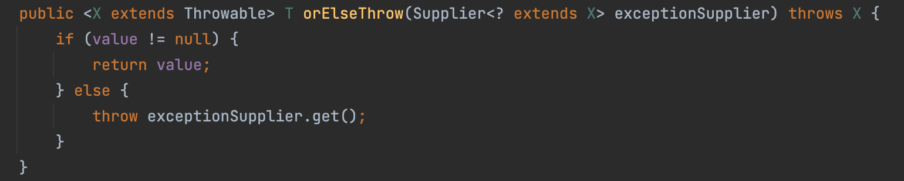
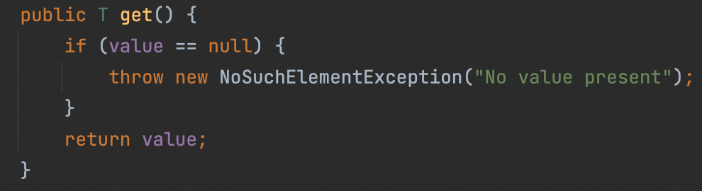
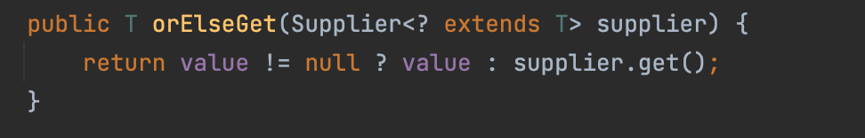

# 옵셔널 반환은 신중히 하라
> 메서드가 `특정 조건에서 값을 반환할 수 없을 때` 취할 수 있는 선택지는 다음과 같이 존재한다.
## 자바 8 이전
> 1. 예외를 던진다.
> 2. 반환 타입이 객체 참조라면, Null을 반환한다.

> 이러한 방법 시 스택 추적 전체를 갭처하므로 비용이 크다. 또한, null 반환은 별도의 null 처리 코드를 추가해야 한다는 단점도 존재한다.

```java
public static <E extends Comparable<E>> E max(Collection<E> c) {
      if (c.isEmpty())
         throw new IllegalArgumentException("빈 컬렉션");

      E result = null;
      for (E e : c)
         if (result == null || e.compareTo(result) > 0)
             result = Objects.requireNonNull(e);
       return result;
}
```

## 자바 8 이후
> 자바 8 이후 도입된 `옵셔널`이란, 원소를 최대 1개 가질 수 있는 불변 컬렉션이다.

> `Optional<T>`에는 `null`이 아닌 T타입 참조를 담거나, 혹은 아무것도 담지 않을 수 있는데, 이로 인해 옵셔널을 반환하는 메서드는 예외를 던지는 메서드보다 유연하고 사용하기 쉬우며 null을 반환하는 메서드보다 오류 가능성이 작아진다.

## Optional 사용법
> T를 반환해야 하지만, 특정 조건에서는 아무것도 반환하지 않아야 할 때 `Optional<T>`를 반환하도록 선언하면 된다.

```java
public static <E extends Comparable<E>> Optional<E> max(Collection<E> c) {
   if (c.isEmpty())
      return Optional.empty();  // 정적 팩터리 메소드

   E result = null;
   for (E e : c)
       if (result == null || e.compareTo(result) > 0)
             result = Objects.requireNonNull(e);
  return Optional.of(result);  // 정적 팩터리 메소드
```
```java
//스트림 버전
public static <E extends Comparable<E>> Optional<E> max(Collection<E> c) {
  return c.stream().max(Comparator.naturalOrder());
```

> - `Optional.empty()` : 빈 옵셔널 반환
> - `Optional.of(value)` : 값이 든 옵셔널 반환. null 값이 들어가면 NullPointerException을 던짐
> - `Optional.ofNullable(value)` : null 값도 허용하는 옵셔널

> 가장 중요한 점은, `Optional.of(value)`에는 절대 null을 반환하지 말아야 한다는 것 이다.

## Optional 활용 예시
> 메서드가 옵셔널을 반환한다면, 클라이언트는 값을 받지 못했을 때 행동을 여러가지 선택할 수 있다.

### orElse
> 기본값을 설정해둘 수 있다.
```java
String lastWordInLexicon = max(words).orElse("단어 없음...");
```

### orElseThrow
> 원하는 예외를 던질 수 있다.
```java
Toy myToy = max(toys).orElseThrow(TemperTantrumException::new);
```


### get
> 항상 값이 채워져 있다고 가정할 수 있다.
```java
Element lastNobleGas = max(Elements.NOBLE_GASES).get();
```

> 단 값이 없다면 `NoSuchElementException`을 발생시킬 것이다.

### orElseGet
> - 기본값을 설정하는 비용이 아주 커서 부담이 된다면, `Supplier<T>`를 인수로 받는 orElseGet을 사용하면 된다.
> - 값이 처음 필요할 때 `Supplier<T>`를 사용해 생성하므로 초기 설정 비용을 낮출 수 있기 때문이다.


### isPresent
> - 안전 밸브 역할을 하는 메서드
> - 옵셔널이 채워져 있으면 `True`, 비어 있으면 `false`를 반환한다.
```java
Optional<ProcessHandle> parentProcess = ph.parent();
System.out.println("부모 PID: " + (parentProcess.isPresent() ?
  String.valueOf(parentProcess.get().pid()) : "N/A"));
```
```java
//map을 이용해 개선한 코드
System.out.println("부모 PID: " +
            ph.parent().map(h -> String.valueOf(h.pid())).orElse("N/A"));
```

## Stream과 Optional
> 스트림을 사용한다면, 옵셔널들을 `Stream<Optional<T>>`로 받아서, 그 중 채워진 옵셔널들에서 값을 뽑아 Stream에 담아 처리하는 경우가 대다수이다.
```java
streamOfOptionals
  .filter(Optional::isPresent)  // 옵셔널에 값이 있다면 
  .map(Optional::get)    // 값을 꺼내 스트림에 매핑
```

### 자바 9 이후
> - Optional을 Stream으로 변환해주는 어댑터인 `stream()` 메서드가 추가되었다.
> - 옵셔널에 값이 있다면 그 값을 원소로 담은 스트림으로, 값이 없다면 빈 스트림으로 변환한다.
```java
streamOfOptionals
  .flatMap(Optional::stream)
```
> - `flatMap()` : 스트림 원소 각각을 하나의 스트림으로 매핑한 다음, 그 스트림들을 다시 하나의 스트림으로 합치는 메소드

## Optional 주의사항
> 1. 컬렉션, 스트림, 배열, 옵셔널 같은 컨테이너 타입을 옵셔널로 감싸면 안된다.
```java
Optional<List<T>>  // X
List<T>      // O
```
> 2. 결과가 없을 수 있으며, 클라이언트가 이 상황을 특별하게 처리해야 하는 경우라면 `Optional<T>`를 반환하자.

> 3. 박싱된 기본 타입을 담은 옵셔널을 반환하지 말자.
>    - 즉, 기본 타입을 옵셔널로 감싼다면 전용 클래스들인 `OptionalInt`, `OptionalLong`, `OptionalDouble` 을 사용하는 것이 좋다.
>      - Boolean, Byte, Character, Short, Float는 예외

> 4. 옵셔널을 키, 값, 원소나 배열의 원소로 사용하면 절대 안된다.