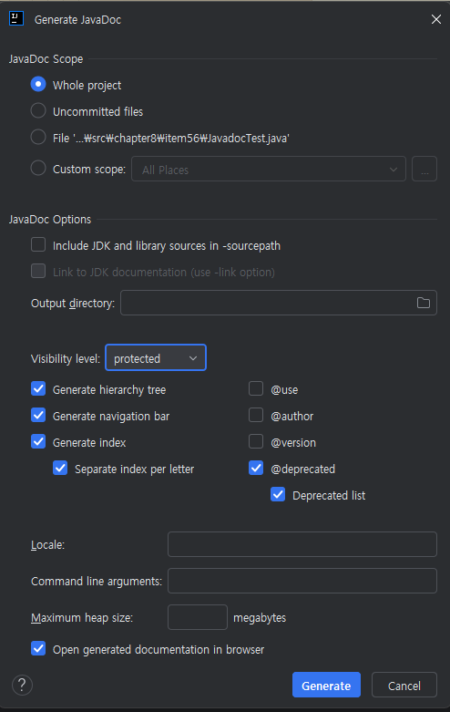
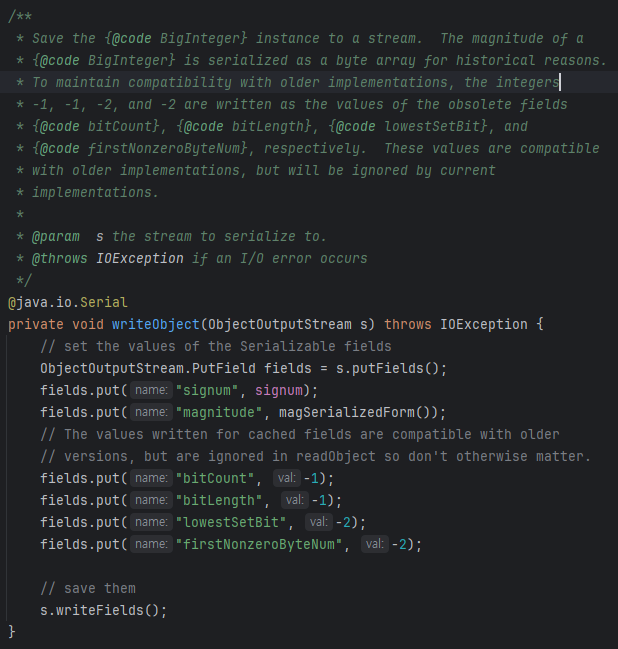
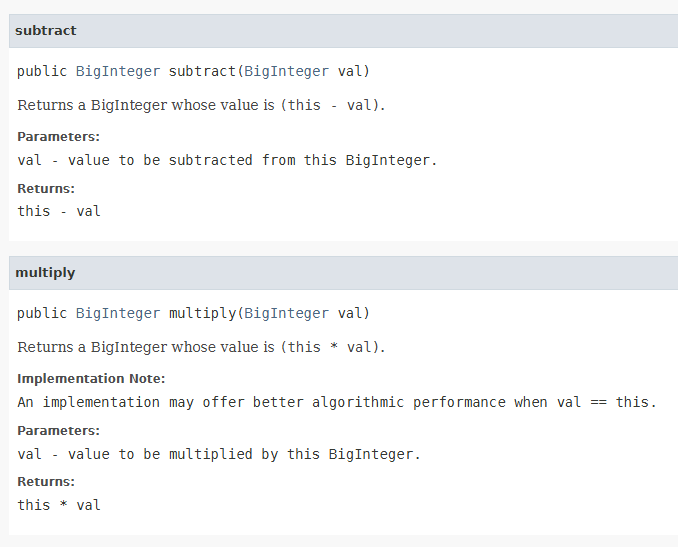
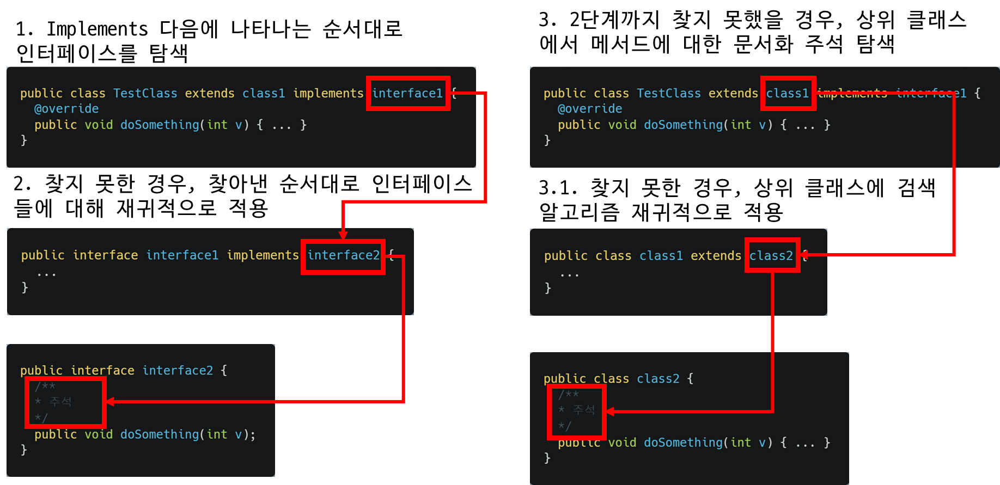

공개된 API 요소에는 항상 문서화 주석을 작성하라
## Javadoc
- API의 수정 사항을 문서에 반영하는 것을 돕는 유틸리티
- 정확히는, `소스코드` 파일에 특별한 형식의 `문서화 주석(doc comments)`으로 기술된 설명을 `API 문서`로 `변환` 해줌
- `문서화 주석`은 Java 프로그래머라면 알아야 하는 업계 표준이라 할 수 있으며, [문서화 주석 작성법(How to write doc comments)](https://www.oracle.com/technical-resources/articles/java/javadoc-tool.html)에 그 내용이 자세히 기술되어 있음
	- 다만, `Java 4 이후`로는 *갱신이 되지 않아* `@literal`, `@code`(이상 Java 5), `@implSpec`(Java 8), `@index`(Java 9)와 같은 *이후 버전*의 `중요 자바독 태그`에 대한 설명은 없음
### 문서화 주석?
```java
// single line comment

/*
 * regular multi-line comment
 */

/**
 * Javadoc (Documentation Comments)
 */
```
- Java의 `주석` 형태 중 하나로, 주석 기호 `/**...*/` 안에 설정되며 내부에서 `HTML 태그` 및 여러 `태그(@로 시작하는)` 들을 사용할 수 있음
- 이러한 주석이 있을 경우, `javadoc 파일명.java`를 사용하여 Javadoc을 생성할 수 있음
	- 
	- `IntelliJ`의 경우, `Tools` -> `Generate JavaDoc` 메뉴를 통해 생성할 수 있음

## 문서화 주석 작성 가이드
### 모든 클래스/인터페이스/메서드/필드 선언에 문서화 주석을 달 것

- *`직렬화` 가능한 클래스*라면, `직렬화 형태`(item 87)에 대해서도 기재해야 함
- 만약 `문서화 주석`이 없다면, Javadoc을 그저 공개 API 요소들의 '선언'만 나열하는게 됨
- Public 클래스에는 절대 `디폴트 생성자`를 사용하지 말아야 함
	- `디폴트 생성자`는 `문서화 주석`을 달 수 없기 때문
- *유지보수*를 위해서는 *공개되지 않은 요소*에도 `문서화 주석`을 다는 것을 권장
### 메서드를 위한 문서화 주석에는 메서드와 클라이언트 사이의 규약을 명료하게 기술할 것
- *메서드의 동작 방식(how)보다*, `무엇을 하는지(what)`를 기술해야 함
	- *`상속용으로 설계된 클래스`가 아닐 경우*
- `문서화 주석`에는 메서드 호출에 대한 `전제조건`, `사후조건`, `부작용`을 명시해야 함
	- `전제조건(precondition)`: 클라이언트가 해당 메서드를 호출하기 위한 조건으로, 일반적으로 `@throw` 태그를 통해 `비검사 예외(unchecked exceptions)`를 `선언`하는 방식으로 `암시적인 기술`을 함(즉, `비검사 예외` - `전제조건` 쌍이 있다고 생각)
		- 또한 `@param` 태그를 통해 전제조건에 영향을 받는 매개변수를 지정할 수 있음
	- `사후조건(postcondition)`: 메서드가 성공적으로 수행된 후 만족해야하는 조건
	- `부작용`: *사후조건으로 명확히 나타나지 않지만*, `시스템 상태에 변화`를 가져오는 것
		- ex) 백그라운드 스레드를 실행시키는 메서드
#### 계약을 명료히 기술하기 위해 태그를 모든 부분에 달 것
```java
/**
* 이 리스트(this list)에서 지정한 위치의 원소를 반환한다.
**
<p>이 메서드는 상수 시간에 수행됨을 보장하지 <i>않는다</i>.
* 구현에 따라 원소의 위치에 비례해 시간이 걸릴 수도 있다.
**
@param index 반환할 원소의 인덱스; 0 이상이고 리스트 크기보다 작아야 한다.
* @return 이 리스트에서 지정한 위치의 원소
* @throws IndexOutOfBoundsException index가 범위를 벗어나면, 즉,
* ({@code index < 0 || index >= this.size()}) 이면 발생한다.
*/
E get(int index);
```
- 예시 코드) 원래는 영어로 작성됨
- 모든 매개변수에는 `@param` 태그를, (*반환 타입이 void가 아닌 경우*) `@return` 태그를, `검사/비검사(checked/unchecked)` 여부에 상관없이 발생 가능한 모든 예외에 `@throws`(item 74) 태그를 달아야 함
	- 만약 `@return` 태그의 텍스트가 메서드 설명과 동일할 경우 생략 가능
- `@param`과 `@return`의 설명은 `해당 매개변수가 뜻하는 값`/`반환 값`을 설명하는 `명사구`를 사용
	- 
	- 드물게 `BigInteger`의 사례와 같이 산술 표현식을 사용하기도 함
- `@throws`의 설명은 `if`로 시작하여, 해당 예외를 던지는 조건을 설명하는 절이 뒤따름
- `{@code}`는 다음 두 가지 효과를 갖는 태그
	1. 태그로 감싼 내용을 `코드용 폰트`로 렌더링함
	2. 태그로 감싼 내용에 포함된 `HTML 요소` 및 다른 `Javadoc 태그`를 `무시`함
		- 이 덕분에 위에서 `<` 와 같은 HTML 메타문자를 바로 사용할 수 있음
		- 만약 여러 줄로 된 코드를 작성하려면 `<pre>` 태그로 `@{code}`를 감싸면 됨(단, 코드 내부에서 `애너테이션`을 사용한다면 `@`에 `이스케이프 문자`를 붙여야 함)
- `@{code}` 코드와 유사하게 `내부 HTML 요소`와 `Javadoc 태그`를 무시하지만, `코드용 폰트`로는 렌더링하지 않는 `@{literal}` 태그도 있음
- 관례상 `인스턴스 메서드의 문서화 주석`에서 사용되는 `this`는 메서드가 위치한 객체를 의미
### 자기사용 패턴(self-use pattern) 문서화 하기
- `상속을 위한 클래스`를 설계할 때, 다른 프로그래머가 `메서드 재정의의 의미`를 알 수 있도록 해당 클래스의 `자기사용 패턴`을 `문서화`해야 함(`제1판 item 15`, 제3판 기준 item 19)
	- `자기사용 패턴`: *클래스를 구성하는 한 부분에서* `다른 부분을 사용`하는 형태
```java
/**
* Returns true if this collection is empty.
* 이 컬렉션이 비었다면 true를 반환한다.
*
* @implSpec
* This implementation returns {@code this.size() == 0}.
* 이 구현은 {@code this.size() == 0} 의 결과를 반환한다.
*
* @return true if this collection is empty
* @return 이 컬렉션이 비었다면 true, 그렇지 않으면 false
*/
public boolean isEmpty() { ... }
```
- 이를 위해, `Java 8`에서 추가된 `@implSpec` 태그를 사용
	- *일반적인 문서화 주석과 달리*, 해당 `메서드`와 `하위 클래스` 사이의 `계약`을 설명
	- `하위 클래스`들이 그 메서드를 `상속`하거나, `super` 키워드를 통해 `호출`시 해당 메서드가 `어떻게 동작하는지` 인지하도록 하는 역할
	 - `-tag "implSpec:a:Implementation Requirements:"` 플래그를 사용하지 않으면, `@implSpec`이 Javadoc에서 무시됨
### 한 클래스/인터페이스 안에 요약 설명이 똑같은 멤버(또는 생성자)를 둘 이상 두지 말 것
- 각 `문서화 주석`의 첫 번째 문장은 해당 요소의 **`요약 설명(summary description)`** 으로 간주됨
	- 바로 위 예시에서 `이 컬렉션이 비었다면 true를 반환한다.`와 같은게 `요약 설명`
- `요약 설명`은 요약하는 요소의 기능을 **`고유하게 기술`** 해야 함
	- `다중정의된 메서드`에 대해서도 이는 허용되지 않음
- 관례에 따르면, `요약 설명`이 완벽한 문장이 되는 경우는 거의 없으며, `메서드`/`생성자`의 요약 설명은 수행하는 `작업을 설명하는 동사구(객체 포함)`여야 함
	- 예시
		- `ArrayList(int initialCapacity)`— `Constructs an empty list with the specified initial capacity.`(`지정한 초기 용량을 갖는 빈 리스트를 생성한다.`)
		- `Collection.size()`— `Returns the number of elements in this collection.`(`이 컬렉션 안의 원소 개수를 반환한다.`)
		- 보이다시피, `2인칭(construct, return)`이 아닌, `3인칭(constructs, returns)`으로 작성해야 함
- `클래스`/`인터페이스`/`필드`의 경우, `대상을 설명하는 명사절`이어야 함
	- 예시
		- `Instant`—`An instantaneous point on the time-line.`(`타임라인상의 특정 지점`)
		-  `Math.PI`—`The double value that is closer than any other to pi, the ratio of the circumference of a circle to its diameter.`(`원주율에 가장 가까운 double 값`)
#### 요약 설명에서 마침표(.)를 조심할 것
- 만약 `요약 설명`에 `마침표`가 포함되어 있다면, 마침표가 요약 설명을 `조기 종료`할 수 있음
	- 가령 `대학 학위, 가령 B.S., M.S. 또는 Ph.D` 라는 문장을 작성했다면 `요약 설명`은 `대학 학위, 가령 B.S, M.S.` 가 됨
	- 이는 요약 설명이 끝나는 기준이 `공백`/`탭`/`줄바꿈(또는 첫 번째 블록 태그)`이 뒤에 오는 `첫 번째 마침표`기 때문
- 따라서 이를 해결하려면 *문제가 되는 마침표를 포함한* 텍스트를 `@{literal}`로 감싸주면 됨
```java
/**
* 대학 학위, 가령 B.S., {@literal M.S.} 또는 Ph.D.
*/
public class Degree { ... }
```
- `Java 10`부터는 `{@summary}` 라는 `요약 설명` 전용 태그가 추가되어 다음과 같이 작성 가능함
```java
/**
* @{summary 대학 학위, 가령 B.S., {@literal M.S.} 또는 Ph.D.}
*/
public class Degree { ... }
```
### Javadoc 색인
- `Java 9`부터는 Javadoc 문서에서 `검색(인덱스)` 기능이 추가됨
	- 우측 상단 검색창에서 검색시 일치하는 페이지들이 드롭다운으로 표시
- `클래스`, `메서드`, `필드`와 같은 API 요소는 `자동으로 색인`이 만들어지며, 필요한 경우 `@{index}` 태그를 사용해 중요한 용어들을 추가로 색인할 수 있음
```java
* This method complies with the {@index IEEE 754} standard.
```
### 제네릭 타입/메서드의 모든 타입 매개변수에 주석을 달 것
```java
/**
* An object that maps keys to values. A map cannot contain
* duplicate keys; each key can map to at most one value.
*
* (Remainder omitted)
*
* @param <K> the type of keys maintained by this map (이 맵이 관리하는 키의 타입)
* @param <V> the type of mapped values (매핑된 값의 타입)
*/
public interface Map<K, V> { ... }
```
### 열거 타입의 상수들에도 주석을 달 것
```java
/**
* An instrument section of a symphony orchestra.
*/
public enum OrchestraSection {
	/** Woodwinds, such as flute, clarinet, and oboe.(목관 악기, 플루트, 클라리넷, 오보에) */
	WOODWIND,
	/** Brass instruments, such as french horn and trumpet. (금관 악기, 프렌치 호른, 트럼펫) */
	BRASS,
	/** Percussion instruments, such as timpani and cymbals. (타악기, 탐파니, 심벌즈) */
	PERCUSSION,
	/** Stringed instruments, such as violin and cello. (현악기, 바이올린, 첼로) */
	STRING;
}
```
- `열거 타입` 자체 및 그들의 `public 메서드`에도 달아야 함
### 애너테이션 타입과 그 멤버들에도 주석을 달 것
```java
/**
* 이 애너테이션이 달린 메서드는 명시한 예외를 던져야만 성공하는
* 테스트 메서드임을 나타낸다.
*/
@Retention(RetentionPolicy.RUNTIME)
@Target(ElementType.METHOD)
public @interface ExceptionTest {
	/**
	* 이 애너테이션을 단 테스트 메서드가 성공하려면 던져야 하는 예외.
	* (이 클래스의 하위 타입 예외는 모두 허용된다.)
	*/
	Class<? extends Throwable> value();
}
```
- `애너테이션 타입`에 대해서는 "이 애너테이션을 단다는 것이 어떤 의미인지"를 설명하는 `동사구`를, 애너테이션의 필드에 대해서는 `명사구`로 설명할 것
### 패키지/모듈에 대한 문서화 주석
- `패키지`를 설명한 문서화 주석은 `package-info.java`, (모듈을 사용한다면) 모듈 관련 설명은 `module-info.java`에 작성하면 됨
### 스레드 안전수준을 API 설명에 포함할 것
- `클래스`/`정적 메서드`가 스레드 안전하든, 안하든 `스레드 안전 수준`을 반드시 API 설명에 포함해야 함(item 82)
	- ex) `Note that this implementation is not synchronized. If multiple threads access a map concurrently, and at least one of the threads modifies the map structurally, it "must" be synchronized externally.` ([TreeMap](https://docs.oracle.com/javase/8/docs/api/java/util/TreeMap.html))
### 메서드 주석의 상속 
- `Javadoc`은 *문서화 주석이 없는* `메서드`에 대해, 자동으로 *가장 구체적으로* 적용할 수 있는 `문서화 주석`을 찾아줌
	- *생성자, 필드, 중첩 클래스는 상속되지 않고*, 오직 `메서드`에 대해서만 적용됨
	- 이때, *상위 클래스보다*, `인터페이스`를 `우선시` 함
- [JavaDoc 명세](https://docs.oracle.com/en/java/javase/11/docs/specs/doc-comment-spec.html)에 따르면, 다음과 같은 순서로 (*적용 가능한 주석을 찾는*)`검색 알고리즘`이 동작

	1. 메서드 선언에서 `implements(또는 extends)`이라는 *단어 다음에 나타나는 순서*대로 `직접 구현(또는 확장)된 인터페이스`를 찾고, 해당 메서드에 대해 `가장 먼저 발견된 문서화 주석`을 사용함
	2. *1단계에서 찾지 못한 경우*, 이 `검색 알고리즘 전체`를 1단계에서 찾아낸 순서대로 `직접 구현(또는 확장)된 각 인터페이스`에 대해 재귀적으로 적용함
	3. *2단계에서도 적절한 문서화 주석을 찾지 못했고*, *현재 대상 클래스가 `Object`가 아닌 다른 클래스이며, 인터페이스가 아닌 경우*
		1. `상위 클래스`에서 `해당 메서드에 대한 주석`이 있다면 이를 `사용`
		2. *`3.1 단계`에서 `문서화 주석`을 찾지 못한 경우*, `검색 알고리즘 전체`를 `상위 클래스`에 `재귀적으로 적용`
- 또는, `@{inheritDoc}` 태그를 사용해 `상위 타입`의 `문서화 주석` 일부를 상속할 수 있음
	- 이를 통해 `구현한 인터페이스`의 `문서화 주석`을 `재사용` 할 수 있음
- 참고) 이러한 상속은`상속된 메서드의 소스 파일`이 `-sourcepath`로 지정된 경로에 있어야만 동작
### 복잡한 API는 별도의 아키텍처 설명도 제공할 것
- *여러 클래스가 상호작용하는 API*라면, `전체 아키텍처를 설명하는 문서`를 관련 `클래스/패키지의 문서화 주석`에 `링크를 통해 제공`해주면 좋음
### Javadoc의 유효성 검사
- Java 7 이전일 경우 `-Xdoclint` 커맨드라인 스위치를 사용하거나, Java 8 이후로는 자동으로 `Javadoc`이 올바르게 작성되었는지 검사해줌
- [체크스타일(checkstyle)](https://checkstyle.sourceforge.io/)과 같은 IDE 플러그인도 있으며, Javadoc이 생성한 HTML 파일을 [HTML 유효성 검사기](https://validator.w3.org/)를 통해 검사하면 오류를 줄일 수 있음
# 핵심 정리
- `문서화 주석`은 API를 문서화하는 가장 훌륭하고 효과적인 방법임
- `공개한 모든 API 요소`에 대해 `주석은 필수`적이며, `표준 규약`을 일관되게 지킬 것
- `문서화 주석`에 HTML 태그를 사용할 수 있으나, `HTML 메타문자`는 `이스케이프 처리`가 필요함을 기억할 것