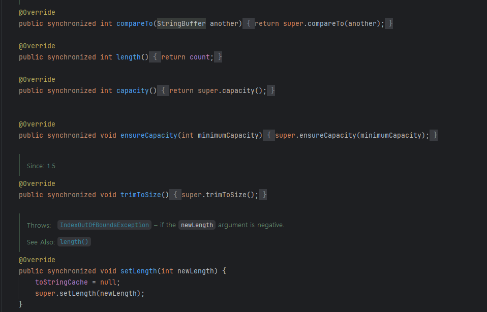
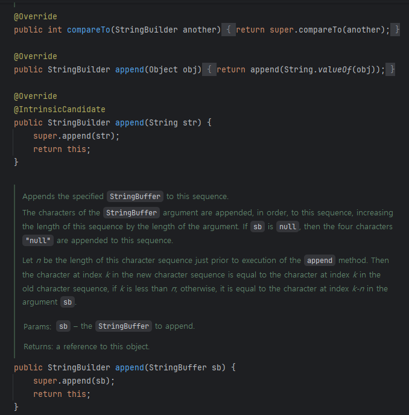

# 문자열 연결은 느리니 주의하라
> 문자열 연결 연산자(+)는 여러 문자열을 하나로 합쳐주는 편리한 수단이지만, 성능 저하가 상당하다. 문자열 연결 연산자로 문자열 n개를 잇는 작업은 n^2에 비례한다.

## 예시
> - [StringConcatTest](StringConcatTest.java)
> - 성능을 포기하고 싶지 않다면 String 대신 StringBuilder를 사용하자
> - statement() 메서드 수행 시간은 Item 수의 제곱에 비례해 늘어나고, statement2() 메서드의 수행 시간은 선형으로 늘어나므로 Item이 많아질수록 그 성능 차이도 심해질 것이다.

## String, StringBuffer, StringBuilder
> Java를 사용하면 접하게 되는 문자열 클래스들
### String
> 먼저 String과 다른 클래스(StringBuffer, StringBuilder)의 차이점은 String은 immutable(불변), 나머지는 mutable(변함)에 있다.

> - String은 문자열을 대표하는 것으로 문자열을 조작하는 경우 유용하게 사용할 수 있다.
> - String 객체는 한번 생성되면 할당된 메모리 공간이 변하지 않는다.
>   - +연산자를 사용하면, 기존에 생성된 String 클래스 객체 문자열에 다른 문자열을 붙여도 기존 문자열에 새로운 문자열을 붙이는게 아니라, 새로운 String 객체를 만든 후, 그 객체를 참조하도록 한다.
> - 문자열 연산이 많은 경우 성능이 좋진 않다.
>   - 하지만, 동기화에 신경쓰지 않안도 되기 때문에(Thread-safe), 내부 데이터를 자유롭게 공유 가능하다.

### StringBuffer, StringBuilder
> - StringBuffer, StringBuilder는 문자열 연산 등으로 기존 객체의 공간이 부족하게 되는 경우, 기존의 버퍼 크기를 늘리며 유연하게 동작한다.
> - StringBuffer와 StringBuilder 클래스가 제공하는 메서드는 서로 동일하다.

#### 두 클래스의 차이점?
> - 동기화 여부
> - StringBuffer는 각 메서드 별로 Synchronized keyword가 존재하여, 멀티스레드 환경에서도 동기화를 지원
>   - 
> - 반면, StringBuilder는 동기화를 보장하지 않음
>   - 
> - 그렇기 때문에, 멀티스레드 환경이라면, 값 동기화 보장을 위해 StringBuffer를 사용하고, 단일스레드 환경이라면 StringBuiklder를 사용하는 것이 좋다.
>   - 단일스레드환경에서 StringBuffer를 사용한다고 문제가 되는 것은 아니지만, 동기화 관련 처리로 인해 StringBuilder에 비해 성능이 좋지 않다.

## 핵심 정리
> - 성능에 신경 써야 한다면 많은 문자열을 연결할 때는 문자열 연결 연산자(+)를 피하자
> - 대신에 StringBuilder의 append 메서드를 사용하자